<div align="center">

# Awesome GPT Image 2.5

**Visual showcases, creative workflows, prompts, comparisons, and practical notes for GPT Image 2.5.**

[English](./README.md) · [简体中文](./README.zh-CN.md) · [Official launch](https://openai.com/index/introducing-chatgpt-images-2-5/)

</div>

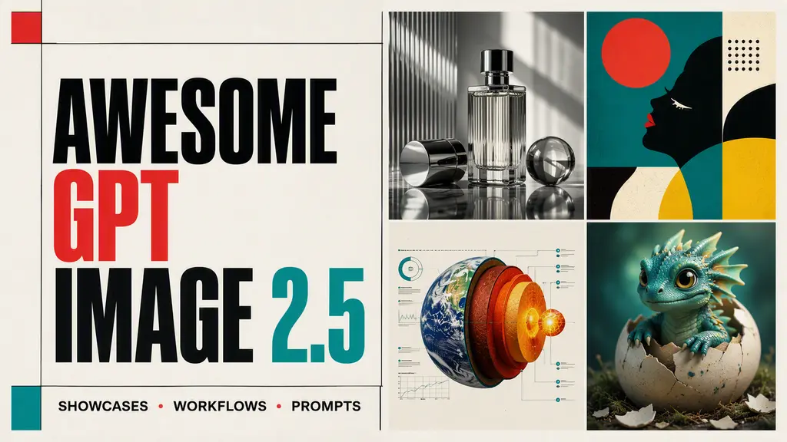

## What is GPT Image 2.5?

GPT Image 2.5 is OpenAI's latest image generation and editing family. In ChatGPT it appears as **ChatGPT Images 2.5**. In the API it is available as **GPT-Image-2.5 Flare** and **GPT-Image-2.5 Sunburst**.

The release focuses on the parts of image creation that usually require the most iteration: preserving a reference, changing only what was requested, maintaining quality across multiple edits, and following more complex visual directions.

### Core capabilities

| Capability | What it enables |
| --- | --- |
| Image generation | Create photographs, illustrations, posters, product images, UI concepts, diagrams, and other visual assets from text and image inputs. |
| Reference fidelity | Carry recognizable subjects and distinctive details from reference photos into new settings, styles, and compositions. |
| Precise editing | Change a product, background, outfit, object, or piece of copy while preserving the surrounding image. |
| Multi-turn consistency | Build on previous edits with less drift and less degradation over a longer conversation. |
| Complex visual direction | Better handle structured layouts, real-world information, transparent backgrounds, and specific artistic styles. |

### GPT Image 2.5 vs GPT Image 2

| Area | GPT Image 2 | GPT Image 2.5 |
| --- | --- | --- |
| Visual quality | Fast, high-quality generation and editing | Sharper details, more natural lighting, richer textures, and stronger style adherence |
| Reference images | High-fidelity image inputs | Better subject recognition and preservation across transformations |
| Editing | Generate and edit images | More reliably changes only the requested element while keeping the rest intact |
| Multi-turn work | Conversational editing through the Responses API | Better preservation of earlier changes and image quality across turns |
| Speed | Baseline | Flare delivers about 50% lower latency; Sunburst trades speed for greater precision |
| Quality controls | `low`, `medium`, `high`, `auto` | Adds `xhigh` and `max` alongside existing quality levels |

Use **Flare** for fast iteration, social content, prototyping, and high-volume generation. Use **Sunburst** when edit precision, typography, product imagery, or polished campaign work matters more than latency.

Sources: [OpenAI launch article](https://openai.com/index/introducing-chatgpt-images-2-5/) · [Image generation guide](https://developers.openai.com/api/docs/guides/image-generation) · [Flare](https://developers.openai.com/api/docs/models/gpt-image-2.5-flare) · [Sunburst](https://developers.openai.com/api/docs/models/gpt-image-2.5-sunburst) · [GPT Image 2](https://developers.openai.com/api/docs/models/gpt-image-2)

## Browse

- [Official gallery](#official-gallery) — OpenAI images and copyable prompts
- [Model comparisons and limitations](#model-comparisons-and-limitations) — benchmarks, trade-offs, and failures
- [Community showcases](#community-showcases) — finished experiments and creative projects
- [Workflows](#workflows) — useful processes you can reproduce

## Official gallery

### Documentary photography

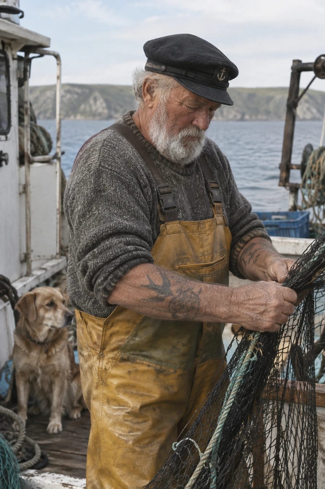

```text
Create a photorealistic candid photograph of an elderly sailor standing on a small fishing boat. He has weathered skin with visible wrinkles, pores, and sun texture, and a few faded traditional sailor tattoos on his arms. He is calmly adjusting a net while his dog sits nearby on the deck. Shot like a 35mm film photograph, medium close-up at eye level, using a 50mm lens. Soft coastal daylight, shallow depth of field, subtle film grain, natural color balance. The image should feel honest and unposed, with real skin texture, worn materials, and everyday detail. No glamorization, no heavy retouching.
```

[OpenAI](https://developers.openai.com/api/docs/guides/image-prompting#control-style-and-lighting)

### Process infographic

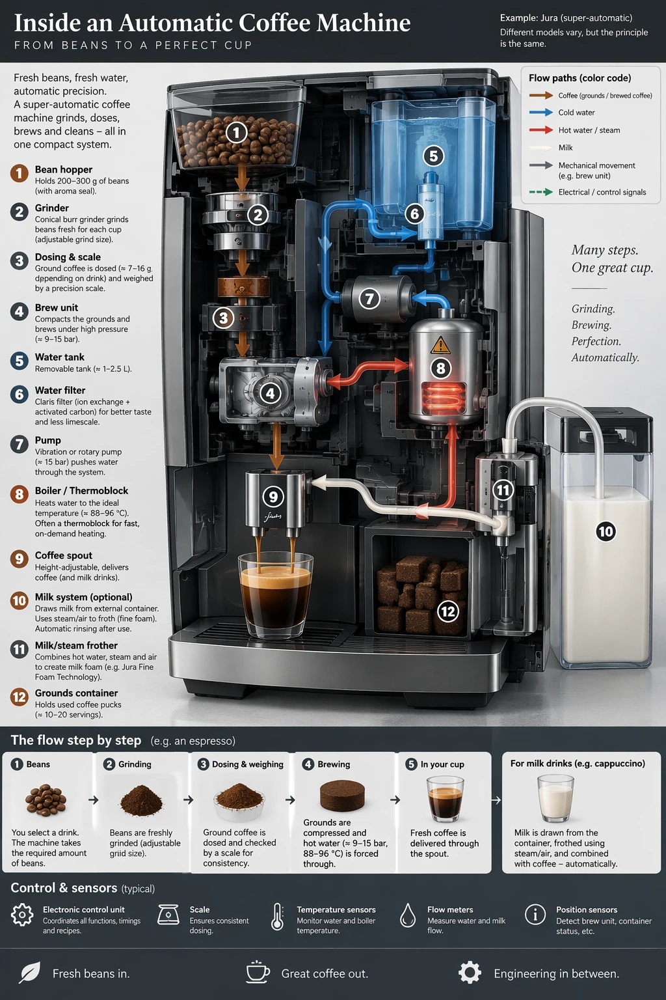

```text
Create a detailed Infographic of the functioning and flow of an automatic coffee machine like a Jura. From bean basket, to grinding, to scale, water tank, boiler, etc. I'd like to understand technically and visually the flow.
```

[OpenAI](https://developers.openai.com/api/docs/guides/image-prompting#explain-a-process-visually)

### Exact-text campaign image

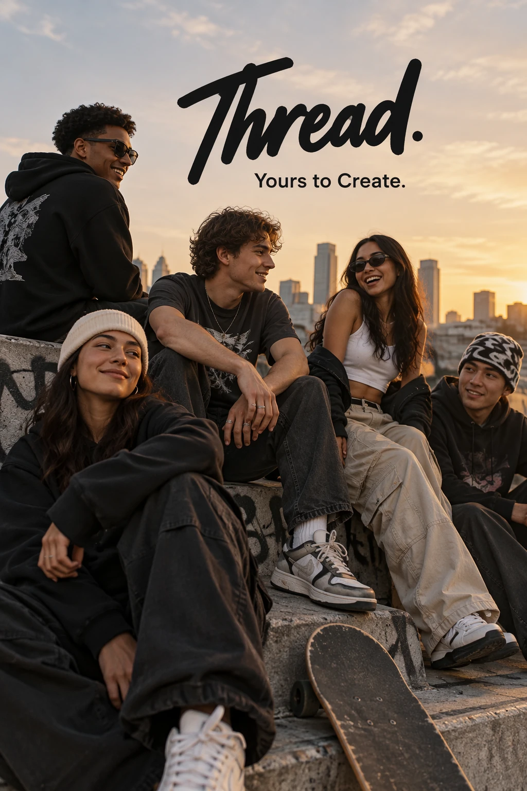

```text
Give me a cool in culture ad / fashion shot for a brand called Thread. It's a hip young street brand. The ad shows a group of friends hanging out together with the tagline "Yours to Create." Make it feel like a polished campaign image for a youth streetwear audience: stylish, contemporary, energetic, and tasteful. Use clean composition, strong color direction, natural poses, and premium fashion photography cues. Render the tagline exactly once, clearly and legibly, integrated into the ad layout. No extra text, no watermarks, no unrelated logos.
```

[OpenAI](https://developers.openai.com/api/docs/guides/image-prompting#render-exact-text)

### Transparent logo

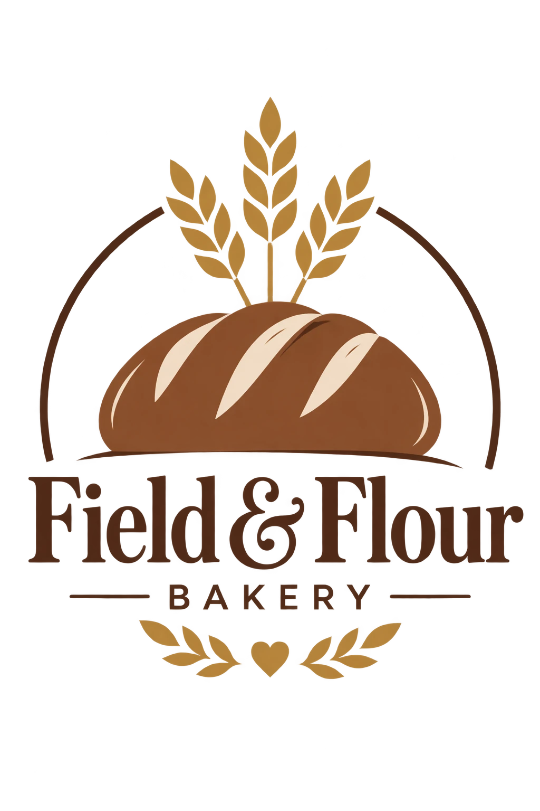

```text
Create an original, non-infringing logo for a company called Field & Flour, a local bakery. The logo should feel warm, simple, and timeless. Use clean, vector-like shapes, a strong silhouette, and balanced negative space. Favor simplicity over detail so it reads clearly at small and large sizes. Flat design, minimal strokes, no gradients unless essential. Fully transparent background. Deliver a single centered logo with generous padding, clean alpha edges, and no solid backdrop, scenery, checkerboard, or watermark.
```

[OpenAI](https://developers.openai.com/api/docs/guides/image-prompting#design-a-reusable-logo)

### Mobile app concept


```text
Create a realistic mobile app UI mockup for a local farmers market. Show today’s market with a simple header, a short list of vendors with small photos and categories, a small “Today’s specials” section, and basic information for location and hours. Design it to be practical, and easy to use. White background, subtle natural accent colors, clear typography, and minimal decoration. It should look like a real, well-designed, beautiful app for a small local market. Place the UI mockup in an iPhone frame.
```

[OpenAI](https://developers.openai.com/api/docs/guides/image-prompting#create-an-interface-preview)

### Translate while preserving layout

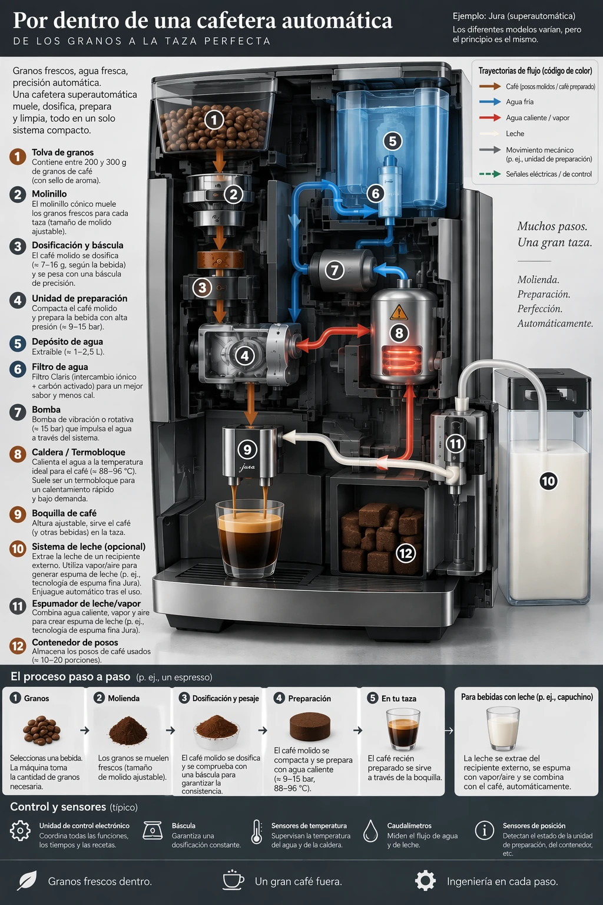

```text
Translate the text in the infographic to Spanish. Do not change any other aspect of the image.
```

[OpenAI](https://developers.openai.com/api/docs/guides/image-prompting#translate-while-preserving-layout)

### Change clothing, preserve identity

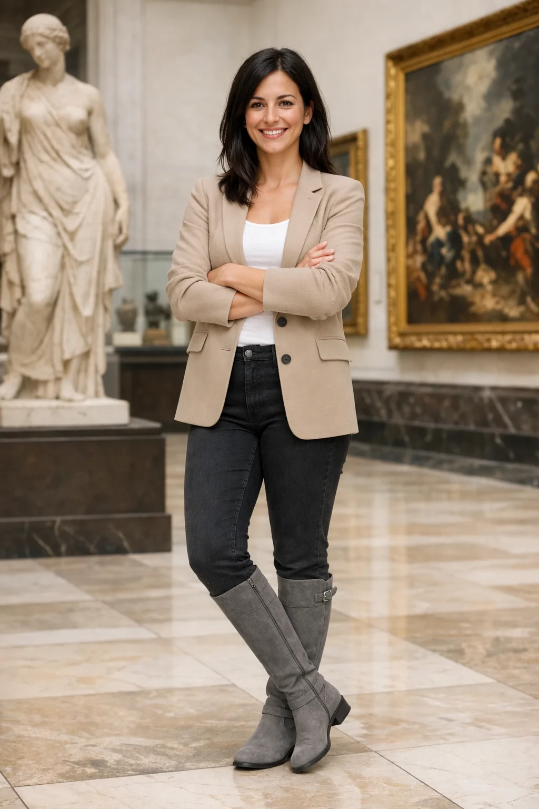

```text
Edit the image to dress the woman using the provided clothing images. Do not change her face, facial features, skin tone, body shape, pose, or identity in any way. Preserve her exact likeness, expression, hairstyle, and proportions. Replace only the clothing, fitting the garments naturally to her existing pose and body geometry with realistic fabric behavior. Match lighting, shadows, and color temperature to the original photo so the outfit integrates photorealistically, without looking pasted on. Do not change the background, camera angle, framing, or image quality, and do not add accessories, text, logos, or watermarks.
```

[OpenAI](https://developers.openai.com/api/docs/guides/image-prompting#preserve-identity-and-change-clothing)

### Product cutout

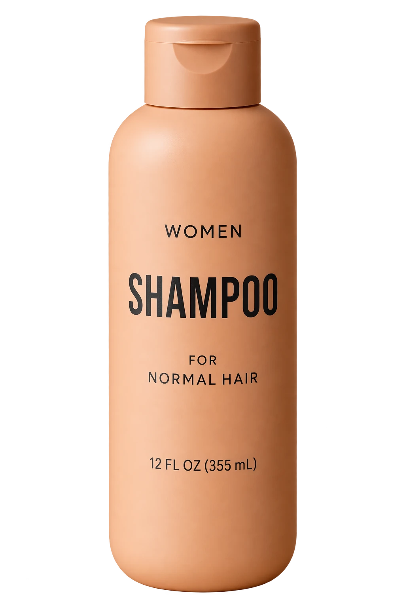

```text
Extract the product from the input image and isolate it on a fully transparent background. Output: centered product, crisp silhouette, no halos/fringing. Preserve product geometry and label legibility exactly. Add only light polishing. Do not add a solid backdrop, checkerboard, scenery, or shadow. Do not restyle the product; remove the background and preserve clean alpha transparency.
```

[OpenAI](https://developers.openai.com/api/docs/guides/image-prompting#create-a-transparent-product-cutout)

### Launch gallery

#### Design, typography, and information

<p align="center">
  
  
  
</p>
<p align="center">
  
  
  
</p>

#### Styles and worlds

<p align="center">
  
  
  
</p>
<p align="center">
  
  
  
</p>

#### Reference-led editing

**Change the outfit, preserve the person**

| Input | Edited |
| :---: | :---: |
|  |  |

**Change the action, preserve the room**

| Input | Edited |
| :---: | :---: |
|  |  |

**Add a costume, preserve the subject and scene**

| Input | Edited |
| :---: | :---: |
|  |  |

All images in this section come from OpenAI's [ChatGPT Images 2.5 launch](https://openai.com/index/introducing-chatgpt-images-2-5/).

## Model comparisons and limitations

### GPT Image 2 vs GPT Image 2.5 Sunburst

`Same prompt` `Fashion campaign` `Low-angle composition` `Community case`

| GPT Image 2.0 | GPT Image 2.5 Sunburst |
| :---: | :---: |
| 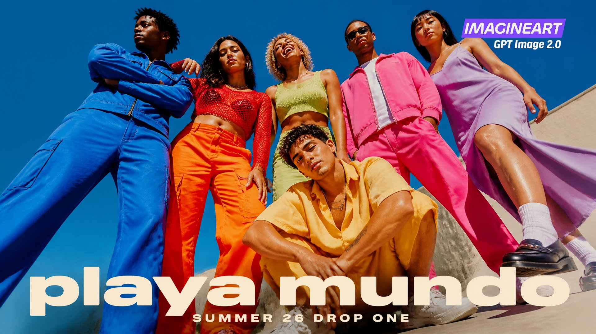 | 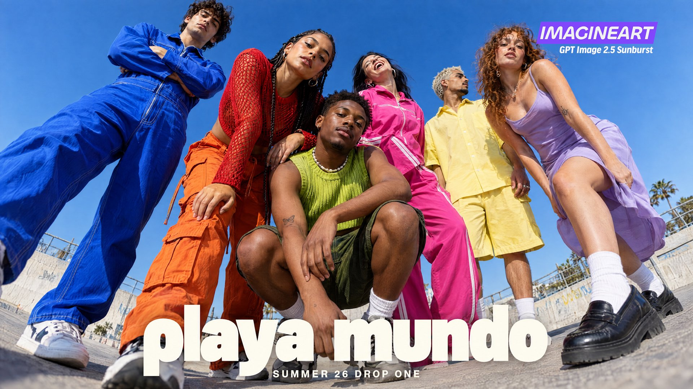 |

The same creative brief asks for a fictional fashion campaign: six people in electric blue, tomato red, teal, hot pink, butter yellow, and lavender, photographed from the ground with a tilted 24 mm perspective against a cobalt-blue sky.

The broad direction survives in both images, while the people, poses, styling details, and environment shift between generations. This is a useful visual comparison, but not a controlled benchmark: the source post does not provide seeds, full API settings, or a per-model retry protocol.

Source: [@3three_AI](https://x.com/3three_AI/status/2097575621870399517). The model labels shown in the images are part of the original post.

### Hair-grid reference

`Same prompt` `Portrait` `Consistency` `Community case`

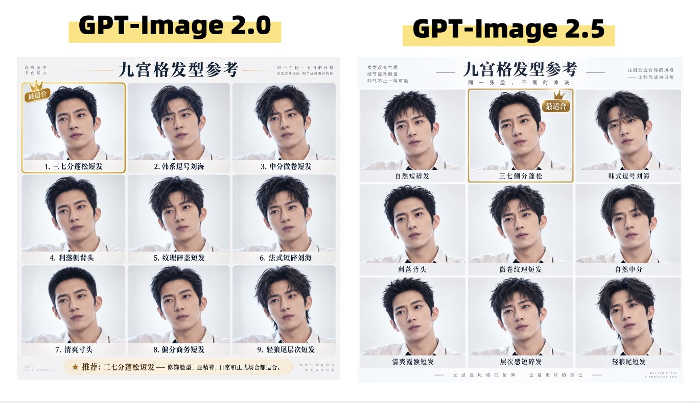

Prompt: generate a nine-panel hairstyle reference from the supplied portrait and identify the most suitable hairstyle. The source post notes that GPT Image 2.0 repeated similar hairstyles in several panels, while GPT Image 2.5 produced more distinct designs with more natural hairlines, flyaways, and layering.

Source: [@3three_AI](https://x.com/3three_AI/status/2097483692998635856).

### Espresso machine cutaway

`Same prompt` `Technical diagram` `Typography` `Community case`

| GPT Image 2.0 | GPT Image 2.5 |
| :---: | :---: |
| 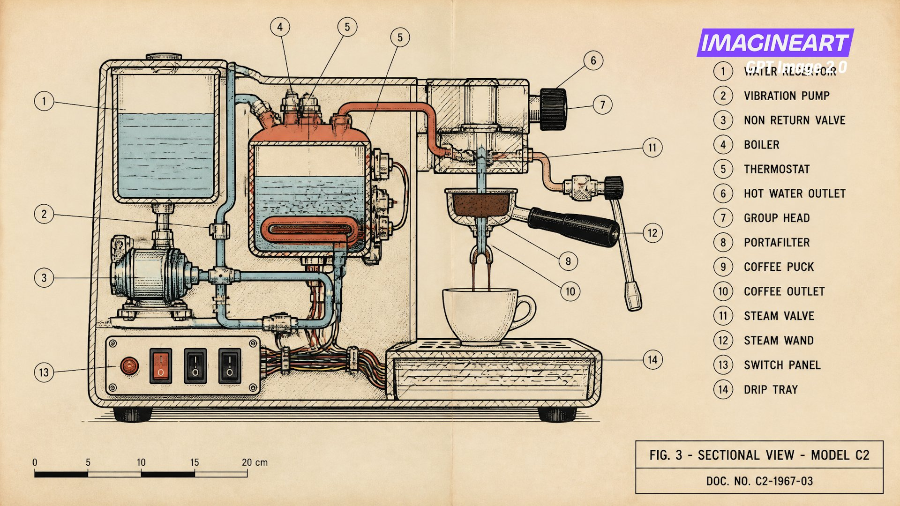 | 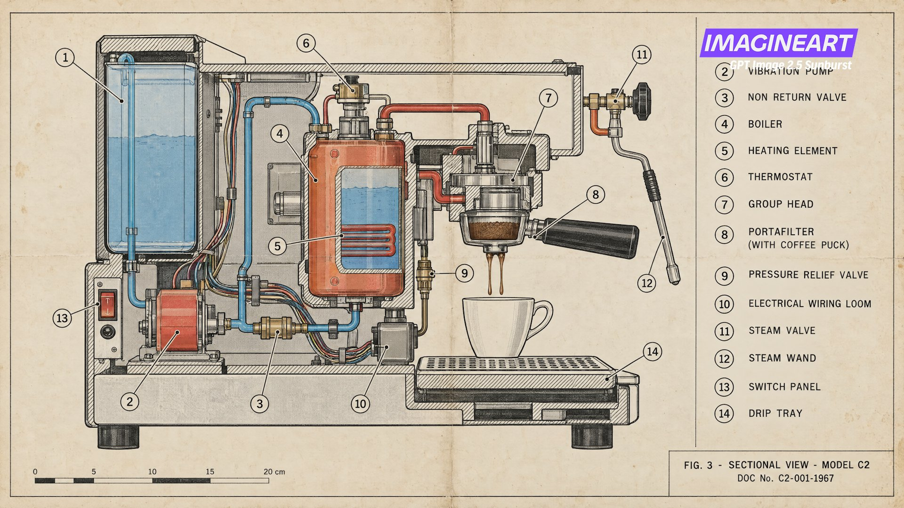 |

The brief asks for a 1960s mechanical drawing of a domestic espresso machine, with 14 numbered callouts, a parts list, a centimeter scale, and the title `Fig. 3: Sectional View - Model C2`. This is a useful comparison for structured diagrams and dense labels.

Source: [@3three_AI](https://x.com/3three_AI/status/2097575614341628370).

### Hand-drawn Japanese animation still

`Same prompt` `Style transfer` `Characters` `Community case`

| GPT Image 2.0 | GPT Image 2.5 Sunburst |
| :---: | :---: |
| 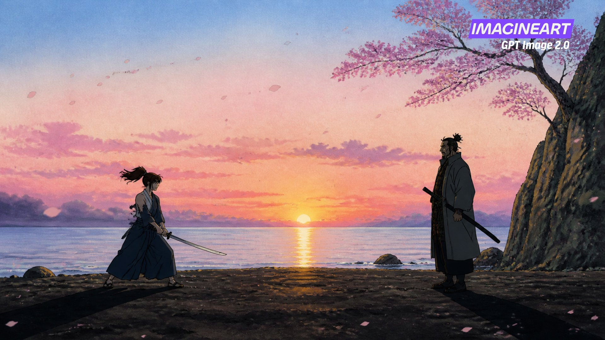 | 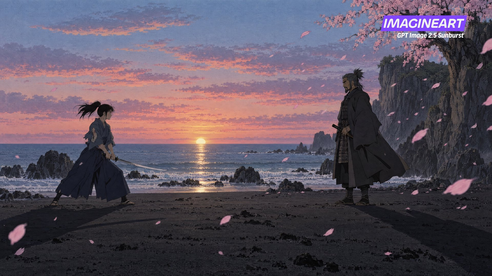 |

The brief describes a late-1990s hand-drawn Japanese animation frame: two sword-bearing characters facing each other by the sea, with cherry blossoms moving across the frame. It tests style, atmosphere, character staging, and environmental detail at once.

Source: [@3three_AI](https://x.com/3three_AI/status/2097575618166788158).

### 1960s Sunday newspaper comic

`Same prompt` `Multi-panel narrative` `Typography` `Community case`

| GPT Image 2.0 | GPT Image 2.5 Sunburst |
| :---: | :---: |
| 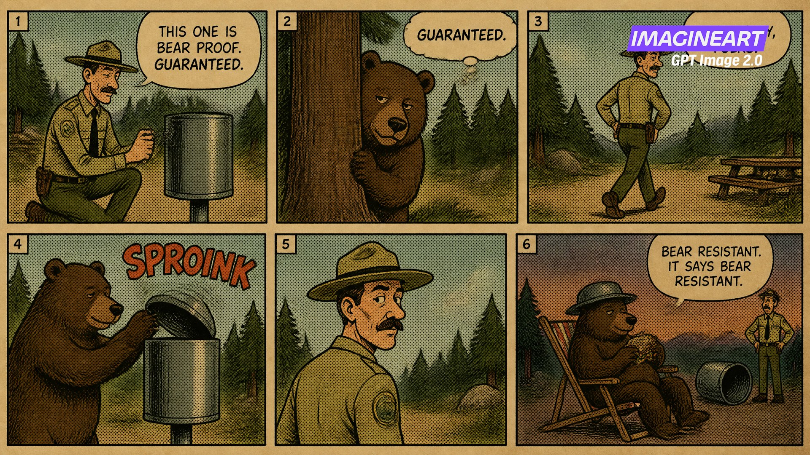 | 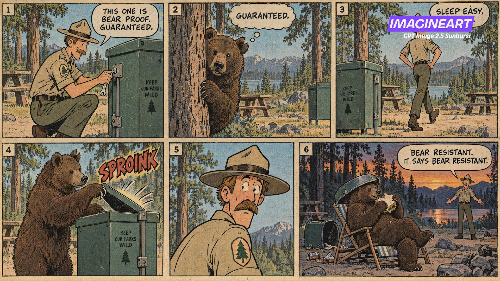 |

This comparison uses a 1960s Sunday newspaper comic brief with six panels, recurring characters, speech balloons, sound effects, and a vintage print treatment. It is a good stress test for sequential composition and text placement.

Source: [@3three_AI](https://x.com/3three_AI/status/2097575625666289844).

### Same complex prompt: GPT Image 2 vs 2.5


In this run, GPT Image 2.5 produced sharper detail and richer textures and was nearly twice as fast, but also introduced more visual noise. [Original post by @TimJayas](https://x.com/TimJayas/status/2097442532980634096).

### Better does not mean exact


GPT Image 2.5 improved this diagram edit but still invented lines that were not present in the ground truth. Diagrams, UI, typography, and infographics still need careful verification. [Original post by @pigeon__s](https://x.com/pigeon__s/status/2097412201778966629).

## Community showcases

### 001 · A 36-frame stop-motion hatchling

`Stop motion` `Character consistency` `Image sequence` `Codex`

<p align="center">
  
</p>

Ivana generated **36 images with GPT Image 2.5** and stitched them together in Codex as a six-second stop-motion sequence. No video model was used.

This is a useful example of treating an image model as a sequence renderer rather than a single-frame generator. The result depends on character, material, camera, lighting, and background consistency across many images.

[Original post by @ivanainai](https://x.com/ivanainai/status/2097446105906553188) · [MP4](images/showcase/stop-motion-ivanainai.mp4)

### 002 · Caterpillar-to-butterfly stop motion

`Stop motion` `Transformation` `Scene consistency` `Image sequence`

<p align="center">
  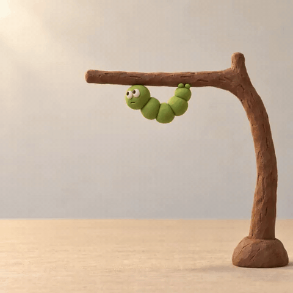
</p>

Charlie Guo shared a 10-second GPT Image 2.5 stop-motion sequence following a caterpillar through chrysalis formation and emergence as a butterfly.

The fixed branch, tabletop, camera, and lighting make the transformation readable while the subject changes across the sequence. It is a compact demonstration of temporal staging with generated still images.

[Original post by @charlierguo](https://x.com/charlierguo/status/2097399137142772071) · [MP4](images/showcase/stop-motion-charlierguo.mp4)

### 003 · Ten-second anime battle sequence

`Image sequence` `Action continuity` `Character consistency` `Existing characters`

<p align="center">
  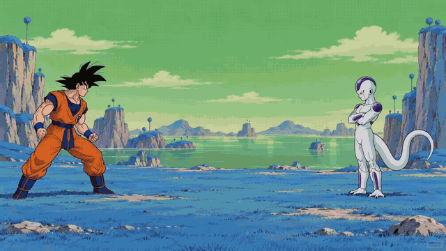
</p>

Chetaslua published a 10-second animation made with GPT Image 2.5 imagery. The sequence uses recognizable existing anime characters and moves from a standoff through charges, impacts, energy effects, and a final aftermath shot.

It is useful for studying action continuity, camera progression, effects, and background stability across a longer generated sequence. No frame count, prompt, or assembly method was disclosed in the post.

[Original post by @chetaslua](https://x.com/chetaslua/status/2097577048651022348) · [MP4](images/showcase/image-sequence-chetaslua.mp4)

## Workflows

### Reference-led product photography

`Photography` `Product` `Reference image` `Character consistency`


The workflow shared by [@Mho_23](https://x.com/Mho_23/status/2097483045221917131):

1. Choose a reference photo with the color grade and creative direction you want.
2. Turn its lighting, palette, contrast, grain, lens, and composition into a detailed style brief.
3. Give GPT Image 2.5 that brief, your product image, and a precise placement instruction.
4. Save the strongest character result and attach it to later generations to preserve the same face.

The reference controls the visual treatment, the character image anchors identity, and the product image controls what must appear accurately.

### Atomic editing

For reliable edits, describe one change and lock everything else:

```text
Keep everything in this photo the same, but replace the broken mug with a clean
one. Match its size, angle, lighting, and shadow.
```

```text
Turn this daytime street photo into a rainy evening. Keep every building, car,
and person exactly where they are. Change only the weather and lighting.
```

More examples in [@cgtwts' original thread](https://x.com/cgtwts/status/2097456916335383025).

---

Official gallery: OpenAI · Community examples: their linked creators · Repository text: MIT
