# Community X Prompts

## poster branding

### 009 · Retro silkscreen character poster

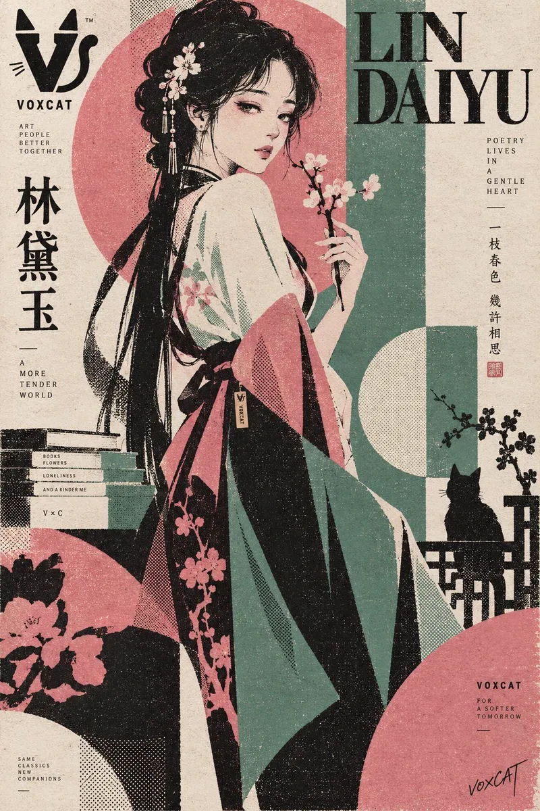

```text
Image2.5测试，效果不错😌

通用完整提示词｜VOXCAT 复古丝网印刷版

{角色}，复古丝网印刷时装插画 × 独立出版海报 × 几何人物设计 × VOXCAT 品牌视觉。

保留角色最具辨识度的发型轮廓、主色调、服装特征与代表性配件，但重新设计为简洁现代的时装造型。人物比例自然偏修长，采用侧身站立、倚靠、转身、回望、抱臂或手持角色道具等静态 Editorial 姿态，根据角色气质自动适配动作。

画面使用 3～4 种高识别专色，以角色代表色建立主色体系，采用硬边平涂、粗颗粒半调网点、丝网印刷墨层、轻微套印错位、局部油墨堆积与纸张纤维纹理。人物轮廓粗而几何，细节高度概括，以大色块和剪影塑造身体与服装，不使用柔和数字水粉效果。

背景采用非对称几何构成，以大面积圆形、矩形、弧线、裁切色块和留白组织版面，让人物与几何图形产生遮挡、穿插与越界关系，形成 1960s–1970s 复古商业印刷 × 当代独立艺术海报气质。

融入 VOXCAT 品牌元素：左上角加入简洁的 stylized “V” × 猫耳/猫尾几何图形 Logo；右下角加入小型手写艺术家签名 “voxCAT”；人物服装根据造型自然加入一处低调 VOXCAT 织标、刺绣暗纹或微型金属铭牌；版面可加入极少量 “VOXCAT / VC / V×C” 微型印刷编号作为设计元素，与丝网印刷系统统一，不喧宾夺主。

竖版人物主视觉，大面积留白，3～4色专色印刷，粗网点，套印偏移，纸张颗粒，几何色块，强剪影，简洁而具有收藏级独立艺术印刷品质感。
```

[@VoxcatAI](https://x.com/VoxcatAI/status/2097410766118977836)

### 013 · Showa-era Japanese travel poster

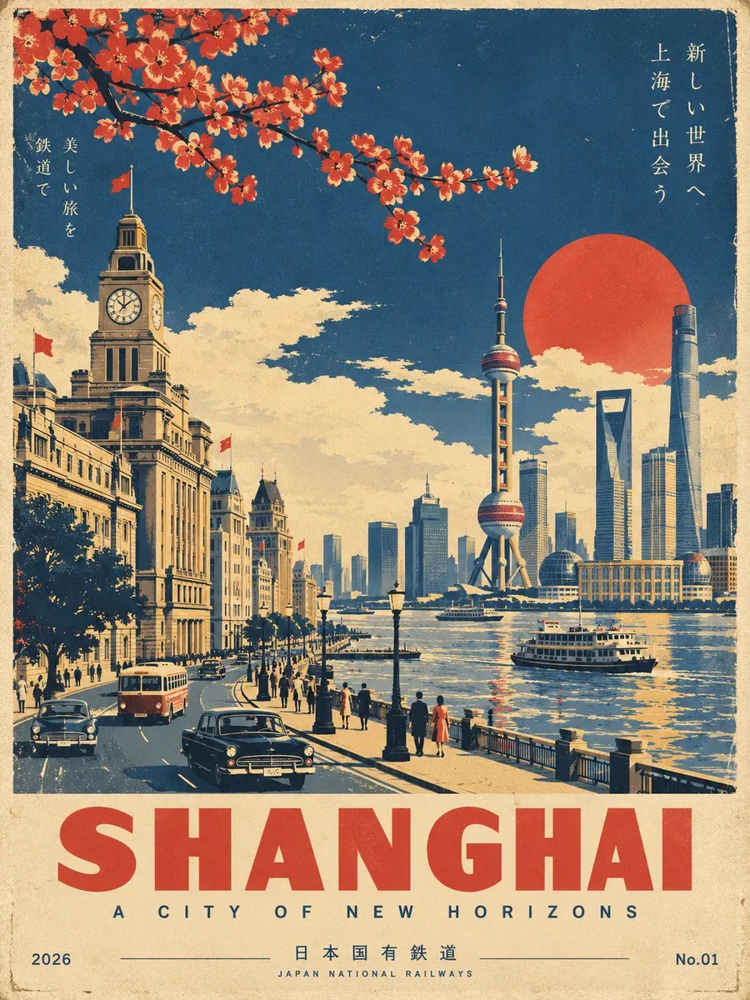

```text
GPT Image 2.5 🤯

Prompt:
 🎨 Create a premium, ultra-refined Showa-era Japanese vintage travel poster for [LOCATION].

FORMAT: Vertical 3:4 | Collector’s travel poster | Mid-century Japanese railway tourism aesthetic

CORE CONCEPT

Create a beautifully composed, instantly recognizable travel scene representing [LOCATION]. Feature its most iconic landmark, architecture, landscape, streets, transportation, and atmospheric details, selecting elements that naturally define the destination.

Reimagine the scene as an authentic 1960s–1970s Japanese railway tourism poster, inspired by classic Japanese National Railways travel advertising and sophisticated vintage screen-printed graphics.

The result should feel like an originally designed vintage poster, not a modern photograph with a retro filter.

VISUAL STYLE

Use bold geometric forms, simplified architecture, clean perspective lines, strong silhouettes, and elegant flat graphic shapes.

Combine sophisticated mid-century Japanese graphic design with traditional screen-print and lithographic aesthetics. Keep the composition cinematic, balanced, spacious, and visually striking.

People and vehicles should be minimal and stylized rather than photorealistic.

COLOR & PRINT TEXTURE

Use a restrained vintage palette of:
deep navy blue, warm ivory/aged paper, muted mustard yellow, and vermilion red accents.

Use flat printed color fields rather than digital gradients. Add subtle paper grain, authentic ink texture, slight ink wear, and delicate vintage print misregistration for a convincing screen-printed feel.

Avoid neon colors, glossy 3D rendering, excessive photorealism, modern AI-art aesthetics, and overly saturated colors.

TYPOGRAPHY & LAYOUT

Reserve generous negative space at the bottom for elegant vintage typography.

Main title: "[LOCATION]"
Large, bold, geometric sans-serif lettering.

Add a refined, location-appropriate subtitle beneath it with generous letter spacing.

Place 2026 discreetly at the bottom left and No.01 at the bottom right.

Typography should feel authentic to a premium Japanese railway tourism poster: restrained, elegant, highly legible, and perfectly integrated into the artwork.

FINAL RESULT

Create a timeless, sophisticated Japanese Showa-era travel poster that feels like a rare original screen-printed railway advertisement from the 1960s–1970s, while showcasing the unique identity, beauty, and most recognizable visual characteristics of [LOCATION].

IMPORTANT: Make [LOCATION] immediately recognizable. Prioritize iconic local landmarks, authentic architecture, distinctive landscapes, and culturally characteristic details. Do not invent generic scenery that could represent any destination.
```

[@Goodmanprotocol](https://x.com/Goodmanprotocol/status/2097542746273726753)

### 032 · Dense frame: six-model fashion campaign


```text
a fashion campaign for an invented label, shot from a camera on the ground with a 24mm lens tilted fifteen degrees. Six people in electric blue, tomato red, lime green, hot pink, butter yellow and lilac, all posed differently, against plain cobalt sky.
```

[@ImagineArt_X](https://x.com/ImagineArt_X/status/2097520459969601977)

## portrait photography

### 010 · Low-angle fantasy character fashion photography


```text
image2.5人像测试

{角色}，明确成年角色，时尚杂志级低机位 Editorial 角色摄影 × 高级奇幻人像。保留角色标志性发型、服装、饰品、兽耳、武器或职业符号，并转译为真实高定 COS / fashion editorial 造型。人物斜倚、半坐或侧坐，一侧膝腿靠近镜头形成自然前景透视与近大远小效果，脸部位于画面中上区域，微侧头、垂眸、浅笑或冷静凝视。35–50mm 近距离低机位拍摄，浅景深，局部自然越框。背景根据角色设定自动适配为暗色东方建筑、奇幻室内、月夜庭院或高级舞台空间。暖金/柔白主光塑造面部，洋红或角色代表色轮廓光勾勒发丝与服装边缘，少量冷蓝环境光分离背景；轻 halation，真实细腻肤质，干净暗部，高级时尚杂志调色，无短视频压缩感。左上角加入 stylized “V” × 猫元素 Logo，右下角加入手写签名“voxCAT”，服装或配件可加入低调 VOXCAT 织标或金属铭牌。9:16 竖版，画面干净清晰，细节稳定。
```

[@VoxcatAI](https://x.com/VoxcatAI/status/2097416442220290078)

### 014 · Subway platform portrait with a train streaking past

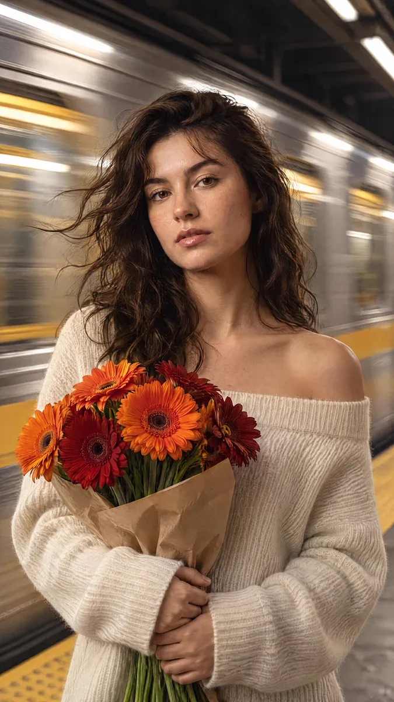

```text
cinematic, high-fidelity portrait of a young woman standing perfectly still on a subway platform as a train rushes behind her. She has warm brown hair with soft bangs and a few loose strands blowing in the wind created by the passing train. Her face is clear and sharp, featuring delicate freckles, soft makeup, and a calm, slightly pensive expression. She is wearing a cream-colored, off-the-shoulder ribbed knit sweater that emphasizes the soft texture of the wool. In her hands, she clutches a vibrant bouquet of orange and deep red gerbera daisies, which serve as the primary color accent against her neutral clothing. The background is a dynamic, horizontal motion blur of a silver and yellow subway train, creating a high-contrast sense of speed against her stillness. The lighting is a blend of cool, overhead station light and warm highlights on her skin, captured with a shallow depth of field and a subtle cinematic film grain.
```

[@weiinberg](https://x.com/weiinberg/status/2097539717973627013)

### 021 · High-detail forest clearing photograph

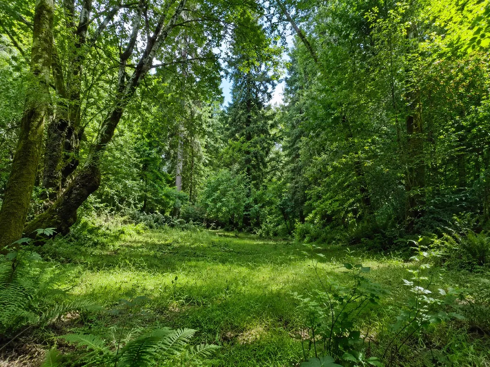

```text
Photo of a clearing in the woods with lots of green foliage, highly detailed
```

[@mark_k](https://x.com/mark_k/status/2097411028510179759)

### 023 · Black-and-white mechanical mask portrait

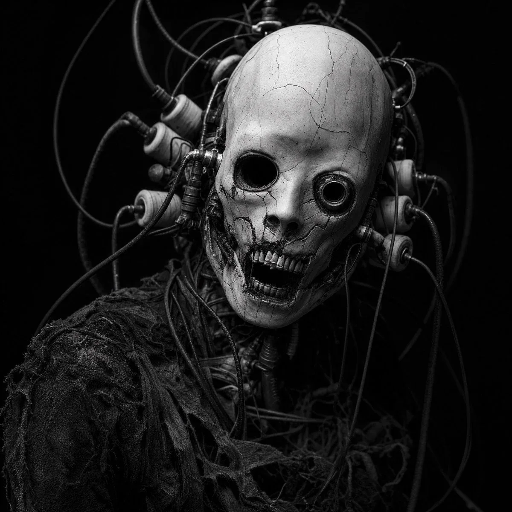

```text
Cybernetic horror portrait, gaunt humanoid figure with cracked porcelain-white skull-like mask, mismatched hollow eye sockets (one sunken void, one recessed metallic ring), jagged exposed teeth, surrounded by a chaotic tangle of thick black cables and industrial bobbin/coil attachments wired into the head, tattered dark fabric top, dramatic low-key lighting, deep black background, high contrast monochrome, horror photography, cinematic, hyperdetailed texture, 85mm lens, shallow depth.
```

[@meng_dagg695](https://x.com/meng_dagg695/status/2097558679956664521)

### 024 · Dreamlike high-angle qipao portrait


```text
9:16, wearing a qipao, soft light bloom, dreamy blur, high-angle shot looking down, tall slender model figure, refined makeup, fox-like beauty face
```

[@BubbleBrain](https://x.com/BubbleBrain/status/2097513469172129825)

### 026 · iPhone portrait in a coffee shop


```text
make me a realistic iphone photo of a woman in a cafe
```

[@blueemi99](https://x.com/blueemi99/status/2097602273085931662)

### 055 · Ultra-narrow 1:3 qipao fashion portrait

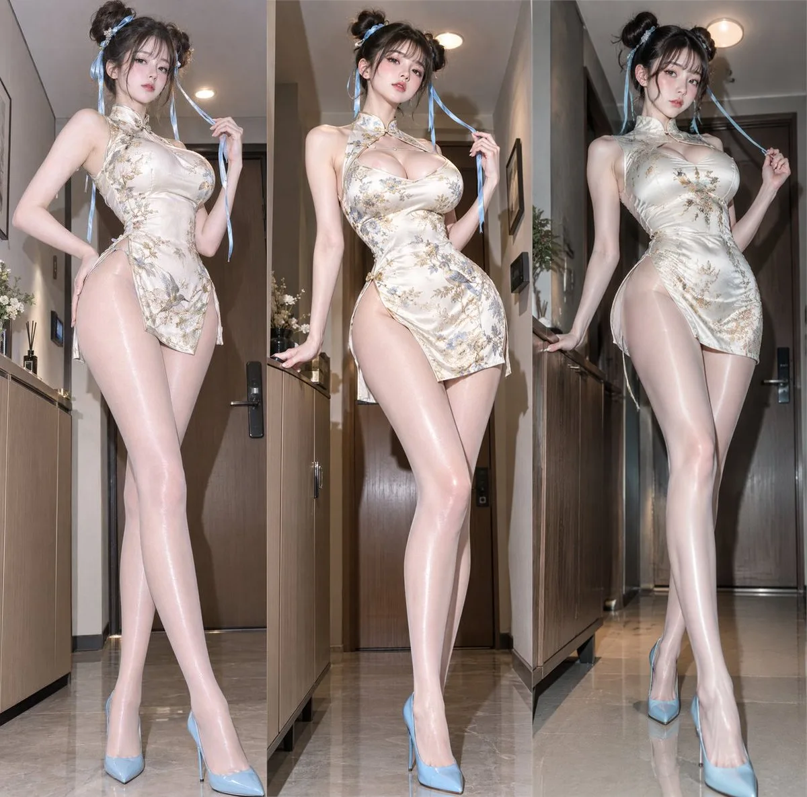

```text
同一套提示词(均在ALT)，三列对照：
左： SG   IP - GPT Image 2
中： SG   IP - GPT Image 2.5
右：美国 IP - GPT Image 2.5

官方刚发2.5：更快、更保脸、光影更自然。
X 上已经有人叫它「狡猾的猪妖」——更快是因为偷懒。
我拿傲娇旗袍、冷青黑裙、战术泳装、古风新娘测完，结论很直接：Image 2 比 2.5 好看；SG 比美区好看
```

[@alanblogsooooo](https://x.com/alanblogsooooo/status/2097599984879440341)

### 056 · Cool-teal soft-focus violinist portrait


```text
同一套提示词(均在ALT)，三列对照：
左： SG   IP - GPT Image 2
中： SG   IP - GPT Image 2.5
右：美国 IP - GPT Image 2.5

官方刚发2.5：更快、更保脸、光影更自然。
X 上已经有人叫它「狡猾的猪妖」——更快是因为偷懒。
我拿傲娇旗袍、冷青黑裙、战术泳装、古风新娘测完，结论很直接：Image 2 比 2.5 好看；SG 比美区好看
```

[@alanblogsooooo](https://x.com/alanblogsooooo/status/2097599984879440341)

### 057 · High-key tactical studio portrait

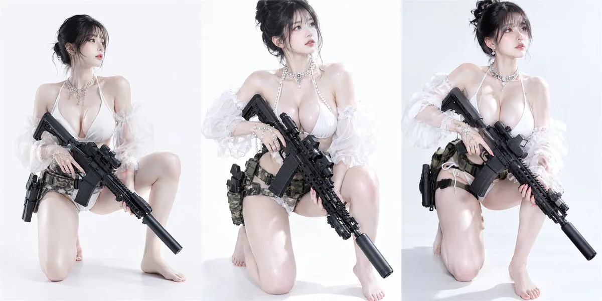

```text
同一套提示词(均在ALT)，三列对照：
左： SG   IP - GPT Image 2
中： SG   IP - GPT Image 2.5
右：美国 IP - GPT Image 2.5

官方刚发2.5：更快、更保脸、光影更自然。
X 上已经有人叫它「狡猾的猪妖」——更快是因为偷懒。
我拿傲娇旗袍、冷青黑裙、战术泳装、古风新娘测完，结论很直接：Image 2 比 2.5 好看；SG 比美区好看
```

[@alanblogsooooo](https://x.com/alanblogsooooo/status/2097599984879440341)

### 058 · New-Chinese-style bride close-up

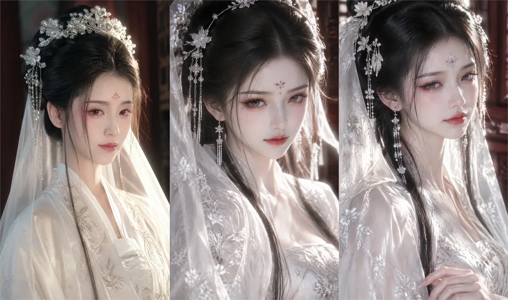

```text
同一套提示词(均在ALT)，三列对照：
左： SG   IP - GPT Image 2
中： SG   IP - GPT Image 2.5
右：美国 IP - GPT Image 2.5

官方刚发2.5：更快、更保脸、光影更自然。
X 上已经有人叫它「狡猾的猪妖」——更快是因为偷懒。
我拿傲娇旗袍、冷青黑裙、战术泳装、古风新娘测完，结论很直接：Image 2 比 2.5 好看；SG 比美区好看
```

[@alanblogsooooo](https://x.com/alanblogsooooo/status/2097599984879440341)

### 060 · Coastal abbey travel portrait


```text
GPT image 2.5 on chatgpt

Prompt

A photorealistic candid travel portrait of a young East Asian woman standing on a quiet sandy shoreline beside large moss-covered rocks, with a magnificent historic stone abbey and medieval castle-like architecture rising dramatically on a rocky island behind her. She has long straight dark brown hair falling naturally over one shoulder, soft youthful facial features, and a gentle warm smile while looking directly at the camera.

She is wearing a long oversized black coat with her hands casually tucked inside the pockets, layered over a light-colored outfit. A large soft cream-white scarf is wrapped warmly around her neck, hanging down the front with a small black designer-style emblem near the end. A delicate chain shoulder bag is partially visible.

The composition captures her in the foreground while the vast historic abbey dominates the background, surrounded by ancient stone walls, rocky cliffs, sandy tidal flats, and a calm coastal atmosphere. A few small distant vehicles and people add realistic scale to the scene. Soft natural evening light and a clear pale blue sky create a peaceful European travel mood.

Ultra-realistic photography, authentic candid travel photo, natural skin texture, realistic fabric details, soft cinematic lighting, subtle smartphone camera aesthetic, slightly dreamy color grading, natural proportions, detailed architecture, peaceful coastal atmosphere, vertical composition, 3:4 aspect ratio.
```

[@saniaspeaks_](https://x.com/saniaspeaks_/status/2097532595814940683)

### 061 · Night city-wall travel portrait


```text
GPT image 2.5

Prompt:
A realistic candid travel photo of a young East Asian woman standing on an old stone walkway beside a historic city wall at night. Behind her is a beautiful traditional Chinese-style building glowing with warm golden lights and deep red accents, with layered roofs, curved upturned eaves, detailed wooden architecture, and softly illuminated windows. Tall red lanterns hang from an ornate black lamp post nearby, adding a warm glow to the scene.
She has long, straight dark brown hair falling naturally over her shoulders and back, with a few loose strands around her face. She has soft youthful features and a gentle, genuine smile as she looks naturally toward the camera. She is wearing an oversized dark charcoal-gray leather jacket with a relaxed, slightly loose fit, paired with wide-leg light-gray jeans. A small black shoulder bag hangs at her side with a cute little white plush charm attached to it.
She is casually leaning against the black metal railing, resting one arm comfortably on it while her body is turned slightly toward the camera. The pose should feel spontaneous and relaxed, like a friend captured the moment while she was enjoying an evening walk. The old dark brick wall stretches behind her, with warm lights highlighting parts of the stonework, while the paved walkway continues into the distance with a few people and subtle city lights.
The sky is a deep gray-blue with soft clouds, contrasting naturally with the warm golden architecture and glowing red lanterns. Keep everything believable and lived-in, with realistic skin texture, natural facial proportions, individual hair strands, authentic leather and denim textures, soft evening shadows, subtle reflections from the lights, and realistic depth of field. Shot with a modern smartphone camera, slightly imperfect and natural rather than overly polished, with soft cinematic tones and a subtle dreamy atmosphere. Wide horizontal 16:9 composition.
```

[@Aqsahere_](https://x.com/Aqsahere_/status/2097693634569396706)

### 072 · Extreme fisheye close-up selfie


```text
超広角フィッシュアイレンズによる極端な近接撮影。カメラを顔のすぐ目の前、わずかに上方に置き、人物がレンズへ顔を強く近づけている。

顔が画面全体の約85〜95%を占める極端な顔面クローズアップ。額、目、鼻、頬、口が画面の大部分を埋め、フィッシュアイ特有の強い遠近感によって、レンズに近い顔が大きく、奥に離れるほど急激に小さく見える。

頭部から胴体へ向かって強くパースが縮み、肩、腕、胴体、脚は画面下側へ向かって極端に小さく収束する。身体は主役ではなく、画面最下部に小さく写り込む程度。大きな顔の直下から、小さな身体が奥へ続いて見える構図。

真正面の平面的なポートレートではなく、顔と身体のスケール差が非常に大きい誇張遠近。レンズ周辺は自然に湾曲し、背景の壁や直線もフィッシュアイによって弧を描く。画面端には軽い魚眼レンズ特有の歪み。

人物はカメラを覗き込むように少し前傾し、自然で楽しそうな表情。顔の向きと視線はわずかに非対称にする。

顔を最大限大きく見せ、身体を画面下部に極端に小さく見せる。
通常のバストアップ、通常のセルフィー距離、均一な身体比率は禁止。レンズの枠なし
```

[@SDT_side](https://x.com/SDT_side/status/2097408563648016835)

### 076 · Vintage kitchen baker portrait series

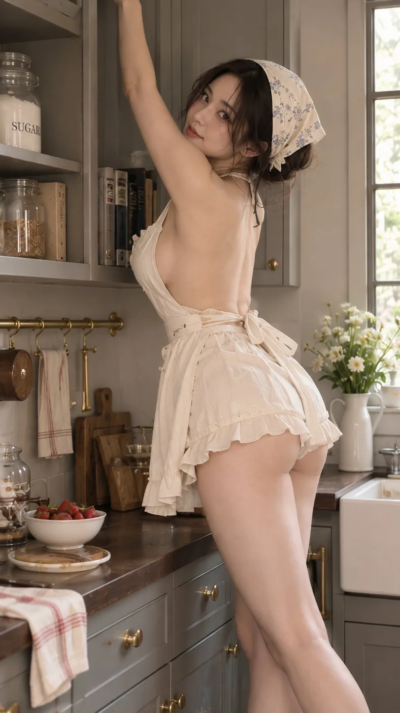

```text
🎉我靠！好猛的提示词！

原来这就是 GPT Image 2.5 啊？

提示词👇🏻 https://t.co/JHwy9ZNMX7
```

[@Lonely__MH](https://x.com/Lonely__MH/status/2097659111798390968)

## scenes illustration

### 011 · Dark epic megastructure spectacle

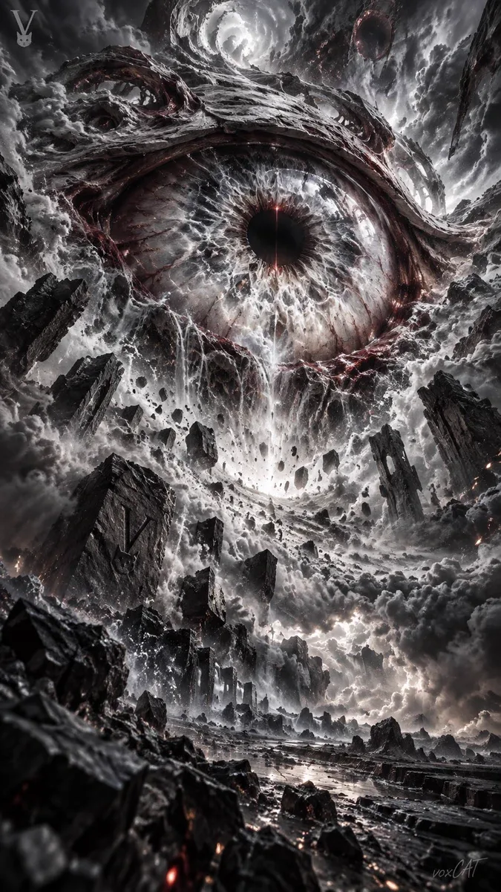

```text
Image2.5测试

{主体}，超尺度奇观 × 黑暗史诗幻想 × 高端电影级 CG × 真实材质 × 崇高尺度构图。

画面中不出现人物，只呈现一个占据绝大部分画面的超尺度巨兽、神兽、机械生命、未知生物或抽象异象。主体从黑暗、烟尘、云雾、碎屑、岩层、液体或能量风暴中逐渐显形，不完整展示全貌，仅突出眼睛、头部、局部肢体或巨大轮廓，制造强烈 Sublime Scale / 巨物压迫感。

主体周围爆发大量真实粒子、尘埃、碎石、雾气、液体飞溅、火花或能量冲击波，以中心区域形成 Radial Dynamic Composition / 放射式爆发构图。高亮区域接近骨白或冷白，外围逐渐沉入炭黑、焦褐、深灰与雾色，仅保留少量朱红或角色代表色作为高纯度视觉锚点。

风格采用 cinematic photoreal CG、physically based rendering、volumetric lighting、ray-traced reflections、realistic fur / skin / stone / metal texture、high-density particles、atmospheric depth、motion debris、subtle lens bloom。强调真实重量、尺度、材质和空间空气感，不使用手绘墨迹，不使用插画笔触。

镜头采用超广角低机位或远距离长焦压缩，根据主体自动适配；构图强调巨大主体越框、局部裁切、前后遮挡与深度层次，形成电影级灾难奇观与神话显现感。

加入 VOXCAT 元素：左上角加入低调 stylized “V” × 猫元素 Logo，可做成金属铭牌、浮雕印记或微型光标识；主体表面、遗迹、装甲或环境结构中可隐藏一处 VOXCAT 压纹或雕刻；右下角加入小型手写签名 “voxCAT”。

9:16 竖版，纯巨物主视觉，无人物，电影级真实 CG，极端尺度反差，体积雾，粒子爆发，真实材质，高动态范围，暗部深沉，高光克制，史诗级奇观。
```

[@VoxcatAI](https://x.com/VoxcatAI/status/2097421155292660066)

### 037 · Dense frame: 90s cel-animation duel

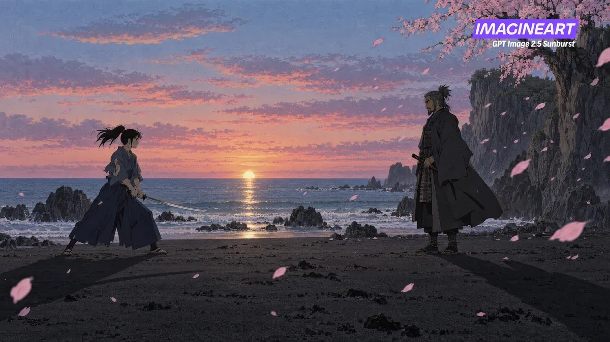

```text
a still from a hand drawn Japanese animated film, late 1990s cel style, painted watercolour background. A dawn duel on black volcanic sand, a woman with a drawn katana facing an older man with a sheathed one, cherry blossom blowing right to left.
```

[@ImagineArt_X](https://x.com/ImagineArt_X/status/2097520459969601977)

### 059 · Tea party inside a giant peony


```text
ChatGPT Images 2.5 这质感，还要啥 midjourney 啊！

prompt 👇

A cinematic wide anamorphic still photograph capturing an intimate floral interior — five miniature young adult Chinese women seated together inside the hollow of an enormous blooming pale-pink peony, its broad curved petals curling upward and outward to form an open floral hall that dominates the frame while all five seated figures remain clearly visible, the camera held at a low, near-eye-line position just above the tea table so the towering petal walls rise dramatically around the group, the composition intimate, unhurried, and quietly domestic.

The five women wear pale silk robes in the ancient Chinese style, soft ivory and blush tones with delicate embroidered hems, their hair swept into simple upswept styles set with delicate hairpins that catch small glints of light. They sit and lean around a low wooden tea table resting on a woven bamboo mat, white porcelain teaware and small pastries arranged between them. One woman pours tea in a steady unhurried pour, the pale liquid catching light as it falls. Beside her, a second woman offers a pastry across the table toward her neighbor, who reaches out with an open hand to accept it, her fingers just meeting the plate's edge. A fourth woman leans in slightly, lips parted mid-conversation, her gaze soft and warm toward the group. The fifth rests her shoulder against the curve of a petal wall, a teacup held loosely in both hands, her eyes lowered in quiet listening. All five wear relaxed, natural poses, their gazes drifting between each other in unforced, overlapping moments of attention.

The peony's interior surrounds them in soft translucent walls — fine branching veins visible through the petal flesh, the edges glowing faintly where afternoon light passes through, the curling petal lips forming a natural open ceiling above the group. Beyond one open gap in the petal wall, the towering stems and stalks of the wider garden rise into view, distant blossoms softening into pale mist and atmospheric haze at the edge of visibility, the miniature world reading as vast and self-contained.

A gentle breeze moves through the floral hall, lifting the edge of a silk scarf, stirring the fine hairs at a hairline, curling the thin ribbon of steam rising from the teapot's spout, and trembling faintly along the petal edges without disturbing the stillness of the seated group. Soft afternoon light filters down through the petal canopy, warm pink bounce light gathering across the near sides of the women's faces and the pale wood of the table, cool lavender shadow settling into the folds of fabric and the deeper recesses between petals where the light doesn't reach.

Captured with a wide-latitude cinema look and a vintage 2x anamorphic character at a wide aperture — gentle oval bokeh on the distant garden stems, soft frame-edge falloff, a light diffusion bloom lifting the brightest petal edges into a soft halation, color-negative daylight film rendition with fine 35mm grain, in an M1 cinematic narrative register. Real photographic frame captured on a real cinema camera, real anamorphic lens, real silk, real porcelain, real human faces and anatomy — no CGI, no rendered look, no digital cleanliness, no plastic surfaces, no AI smoothness, no skin smoothing, no doll-like faces, no waxy sheen.
```

[@johnAGI168](https://x.com/johnAGI168/status/2097523873059147957)

### 063 · Isometric country diorama poster


```text
Isometric Country Dioramas

GPT Image 2.5 (left) Vs GPT Image 2 (right)

Prompt👇🏻 https://t.co/A8IcMTXth8
```

[@abxxai](https://x.com/abxxai/status/2097651231569399814)

### 065 · Japanese dragon versus samurai, xerox print style

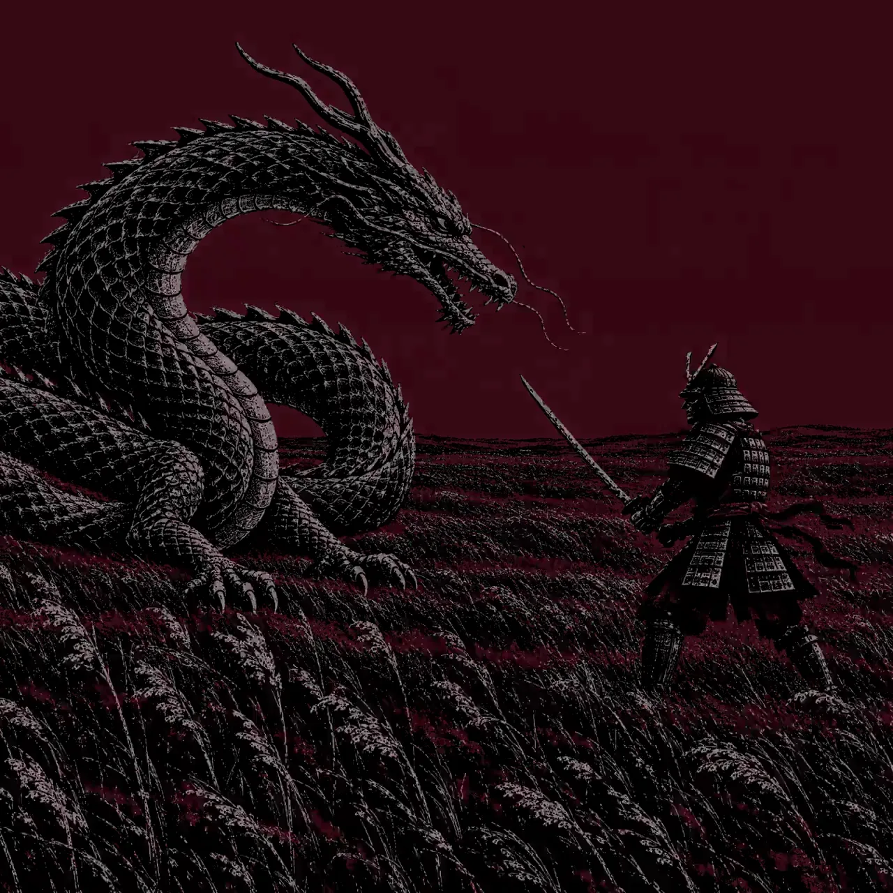

```text
GPT-Image 2.5 looks way stronger than previous models in action.

Prompt below:

Create a single square 1:1 artwork, 2048 × 2048.

"SCENE AND COMPOSITION
A giant Japanese dragon confronting a lone samurai in a vast windswept grassland. Wide view, fixed low camera, both subjects clearly situated in the same landscape. The dragon dominates the left side; the full-body samurai stands on the right, facing left toward the dragon. Leave a clear gap between them. A low, gently rolling horizon divides the open sky from the dense grassy field.

DRAGON
An unmistakably reptilian Japanese serpentine dragon with a long coiled body and an elegant S-curving neck. Large overlapping scale plates, broad segmented belly scutes, hard triangular dorsal spines, swept-back antler-like horns and a few long, smooth whiskers. An elongated reptilian skull with visible nostrils, an armored brow and a slightly open jaw showing sharp conical teeth. Powerful clawed forelimbs planted in the grass. Its head angles downward toward the samurai.

Completely hairless: no fur, mane, beard, feathers, wolf ears or mammalian muzzle. No wings. Define the body with individual scale plates, never hair-like strokes.

SAMURAI
A full-body warrior seen from a three-quarter back/profile angle. Traditional kabuto helmet with a crescent crest, menpo mask, layered shoulder guards, intricately laced lamellar armor, divided armored skirt and shin guards. Knees slightly bent, feet firmly planted, torso leaning into a defensive stance. Both hands hold one katana diagonally upward-left between him and the dragon. Long cloth ties stream sideways in the wind.

FIELD
Dense tall grass fills the foreground and stretches far into the distance. Large bent blades and seed heads near the camera, progressively finer grass toward the horizon. Broad curved bands of leaning grass suggest wind rippling across the entire field. Rich, irregular white scratches describe individual stems against deep black masses.

PALETTE AND RENDERING
A strictly limited palette of cool dark cherry red, approximately #901C35, absolute black and near-white. Flat cherry-red sky; the same red appears between grass blades and in the samurai’s cloth ties.

Realistic dimensional forms translated into an aggressively thresholded black-and-white xerox print. Crushed black shadows, fractured white highlights, dense stippled dithering, scratched engraving, irregular ink coverage and crunchy, slightly pixelated edges. A gritty photocopied dark-fantasy image, not polished digital painting. Preserve fine detail in scales, armor and grass.

No smooth gradients, glossy CGI, clean anime shading, soft lighting, orange-red sky, buildings, trees, mountains, sun, moon, extra characters, duplicate swords, text, logos, borders, panels or watermarks. One complete full-bleed image."
```

[@higgsfield](https://x.com/higgsfield/status/2097520952242524190)

## characters stickers

### 012 · Nine transparent 3D emoji stickers

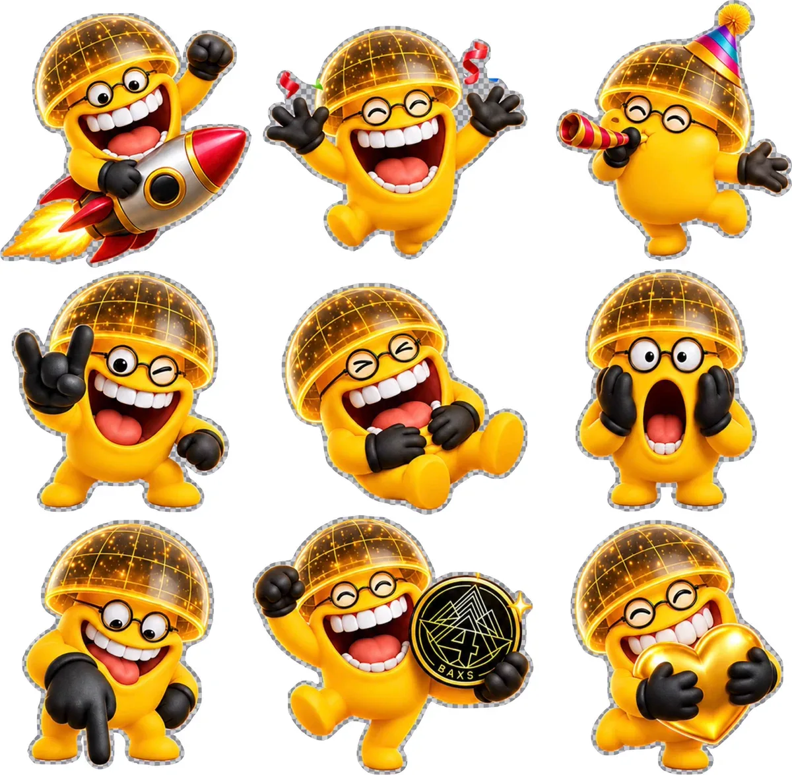

```text
用 GPT-Image-2.5 图像生成的🍄头全新贴纸

归零街的孩子们，记得我
祝你们今日 K 线冲冲冲

提示词 #prompt #image25 #chatgpt 如下
 基于我上传的图片，
设计一套  3D 表情包 1:1 透明贴纸页，
包含 9 个各不相同的贴纸，
按 3X3 网格排列每个贴纸呈现不同的表情、姿势或反应。贴纸之间留出较宽且完全透明的间隔。
无背景、阴影或重叠元素，融入🚀🎉🥳🤟
```

[@BAXSCTO](https://x.com/BAXSCTO/status/2097554076494102704)

### 022 · Sixteen-frame goblin archer sprite sheet


```text
GPT-Image 2.5的鹈鹕测试来了
对比2.0的稳定性有了巨巨巨巨大的提升..
所以直接做精灵图就行了..不会影分身的就是image 2.5了
图2就是古早产物

不要使用技能,制作做一张精灵图
这张图包含一名像素风男性哥布林拉弓箭射出的过程
总计16帧.
然后将该图切图,并制作成永动gif https://t.co/rd1awsCMG4
```

[@Fomsky_Wei](https://x.com/Fomsky_Wei/status/2097559943075533257)

### 025 · Character combat-action pixel sprite sheet

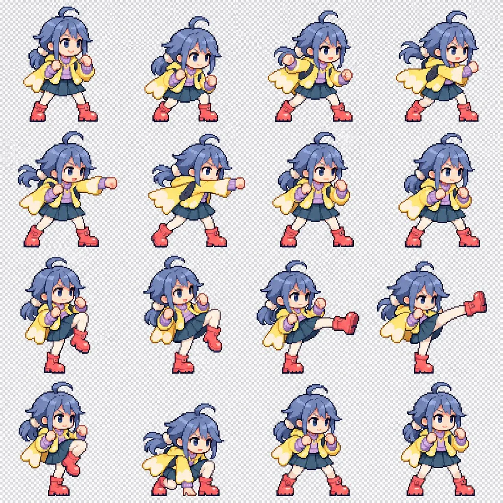

```text
Create a combat-motion sprite sheet of this character as simplified 128 px pixel art. Make the background transparent if possible, and arrange the frames in a 4 × 4 grid.
```

[@8co28](https://x.com/8co28/status/2097423580229521849)

### 027 · Animation character sheet: GUEST


```text
ChatGPT Image 2.5 is crazy for storytelling..

it turns any idea into detailed storyboard with cast design.. then use seedance 2.5 to make a full film scene..

check free workflow and prompts 👇 https://t.co/p1l1PxZEZb
```

[@EHuanglu](https://x.com/EHuanglu/status/2097519538632024103)

### 028 · Animation character sheet: CHEF


```text
ChatGPT Image 2.5 is crazy for storytelling..

it turns any idea into detailed storyboard with cast design.. then use seedance 2.5 to make a full film scene..

check free workflow and prompts 👇 https://t.co/p1l1PxZEZb
```

[@EHuanglu](https://x.com/EHuanglu/status/2097519538632024103)

### 029 · Character pixel idle animation

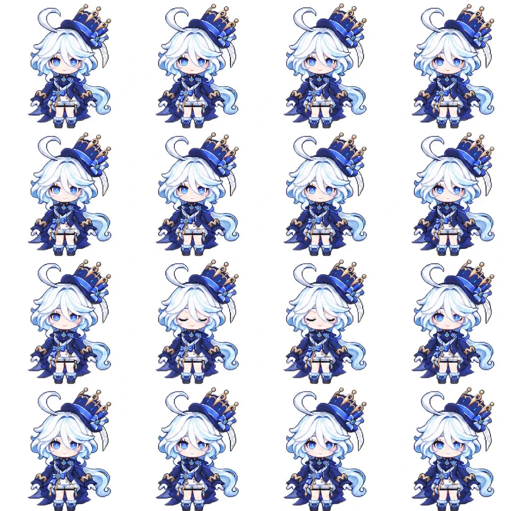

```text
GPT Image 2.5 - Prompt Share

This prompt turns any character reference into a pixel-art idle animation.

Prompt in the replies. Try it with your character! 👇 https://t.co/nwZ6p5zrnB
```

[@Mayz1169](https://x.com/Mayz1169/status/2097533706022056339)

### 030 · Nine pixel action poses at a locked scale

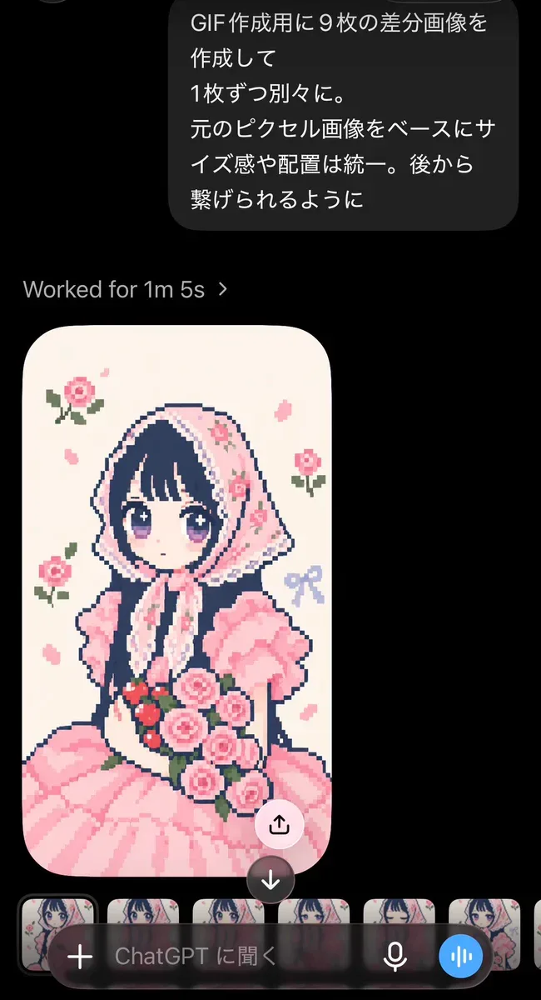

```text
Create nine variation images for a GIF, each as a separate image. Base them on the original pixel image, keeping the scale and placement consistent so they can be joined afterward.
```

[@elle_elle_e](https://x.com/elle_elle_e/status/2097439673308389840)

### 067 · Resin figure 360° split-screen animation


```text
Comparing GPT-Image 2.0 to GPT-Image 2.5

Sharing the prompt:

"Create a continuous 6-second split-screen animation from the supplied image. Preserve both matching silver-haired gothic anime resin figures and all facial, costume, hair, sword, boot, and base details. Use two equal panels with synchronized motion. Both figures must simultaneously rotate clockwise with their bases through one full 360° turn at 60°/s while gesturing: front at 0s, side at 1.5s, back at 3s, opposite side at 4.5s, and front at 6s. From 0–2s, wave the free right hand beside the face; from 2–4s, brush the hair back with a slight head tilt; from 4–6s, lower the hand to the hip and end in a confident front-facing pose with a soft smile. Keep the left hand holding the fully sheathed katana downward and both feet fixed to the rotating base. Preserve smooth articulation, subtle secondary motion, and the painted-resin finish. Keep both complete figures and bases visible against a near-white studio background. Camera, lighting, scale, divider, and turntable centers stay fixed. No cuts, reversals, camera movement, extra objects, text, watermark, graphics, or audio."
```

[@higgsfield](https://x.com/higgsfield/status/2097486959296057609)

### 068 · Pixel heroine, eight seconds of continuous action

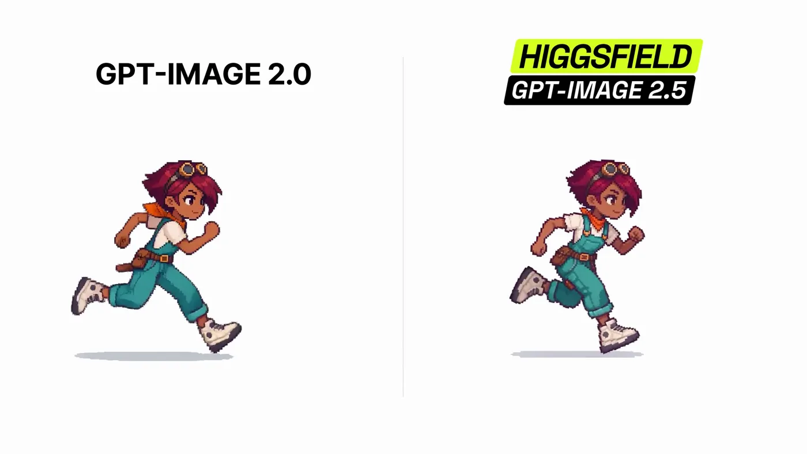

```text
Comparison between GPT-Images 2.5 vs GPT-Images 2.0

Here's the prompt:

"Animate the supplied pixel-art heroine in one continuous 8-second side-view shot. Preserve her exact design, colors, proportions, crisp pixels, and outlines. Lock the camera and pale blue-gray background. Keep her full body near center, facing right, with no more than 25% horizontal travel. From 0–2.5s, run mostly in place with alternating strides and arm pumps. From 2.5–4.5s, perform one two-foot jump and land crouched. From 4.5–6.5s, perform one full forward ground somersault: hands down, tuck, roll over the shoulders, feet over head, and land on both feet. From 6.5–8s, rise into a balanced ready pose. Animate at exactly 6 FPS with 167ms frame holds, normal speed, and no interpolation, blending, optical flow, or blur. On every frame, shift the whole sprite slightly and unpredictably on both axes to create strong constant jitter, especially in the final pose. Only the heroine moves; the camera and background remain still. No cuts, cartwheels, aerial flips, scene changes, text, particles, weapons, duplicates, audio, 3D, color flicker, morphing, or design drift."
```

[@higgsfield_ai](https://x.com/higgsfield_ai/status/2097486391613792518)

### 069 · Spellbook mishap: 16-frame looping sprite sheet

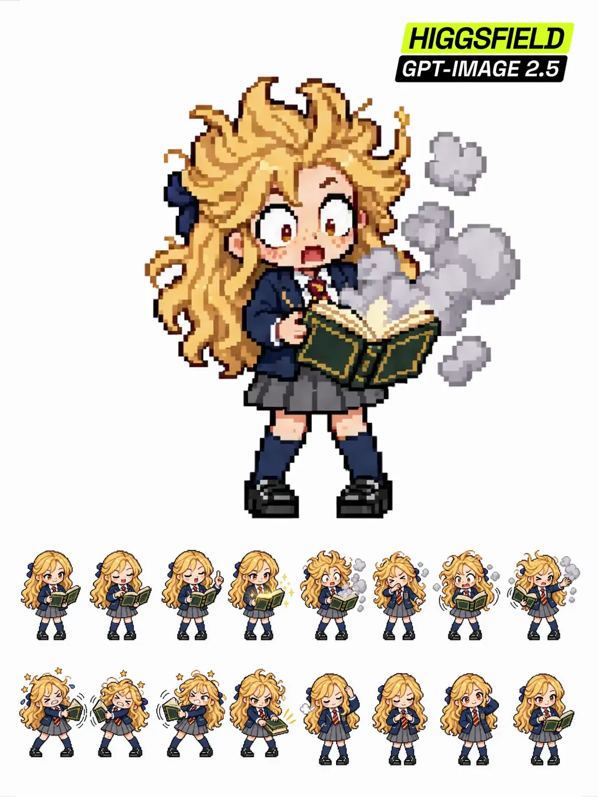

```text
GPT-Images 2.5 can generate 2D character animation sprite sheets for your vibe coded video game.

Prompt below 👇 https://t.co/71BYRqc3Dd
```

[@higgsfield](https://x.com/higgsfield/status/2097501257581965739)

### 070 · 128px combat-return sprite sheet


```text
"Create a simplified 128-pixel pixel art for the character, depicting their combat return animation. If possible, make it transparent. Arrange them in a 4x4 grid."
```

[@HitPawofficial](https://x.com/HitPawofficial/status/2097570316679884838)

### 071 · Reusable 16-frame sprite sheet template


```text
Create a pixel-art animation sprite sheet of the character in the reference image, with a transparent background. Arrange 16 frames in a 4×4 grid, ordered from left to right, top to bottom. All 16 frames must form one continuous sequence of the same action, with smooth transitions between adjacent frames. Keep the character’s appearance, scale, and alignment consistent throughout. The action: [describe your desired action].
```

[@underwoodxie96](https://x.com/underwoodxie96/status/2097554154554314891)

### 073 · Reference photo to chibi pixel idle loop

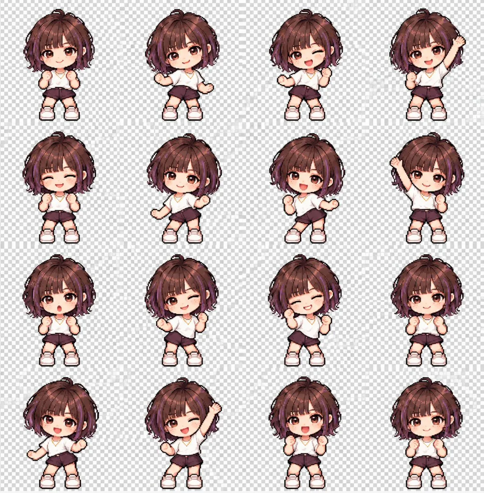

```text
试了下 GPT Image 2.5 gif 动图功能！好可爱呀！

提示词👇 https://t.co/3wtj8qk0us
```

[@hahazwei](https://x.com/hahazwei/status/2097591465329488095)

### 074 · Magical-girl 30-frame transformation sheet

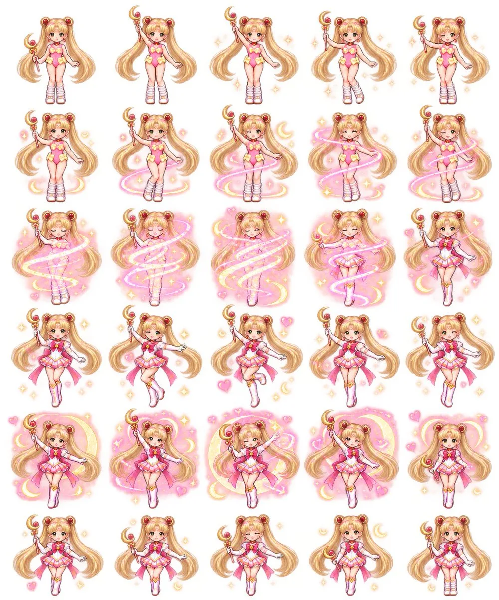

```text
“代表月亮，消灭你！🌙✨”

GPT-Image 2.5 今天更新后，这个玩法真的超级有趣。
一张角色图，GPT 就能直接做出整套 像素变身 Sprite Sheet。

再把每一帧拆出来，直接合成 GIF。
从出图到 GIF，基本 GPT 就可以完成。

Prompt、制作方法放评论区👇👇👇 https://t.co/eDxvssUU4f
```

[@Chengzilhy](https://x.com/Chengzilhy/status/2097663816230478149)

### 075 · LINE-style 16-frame sticker animation

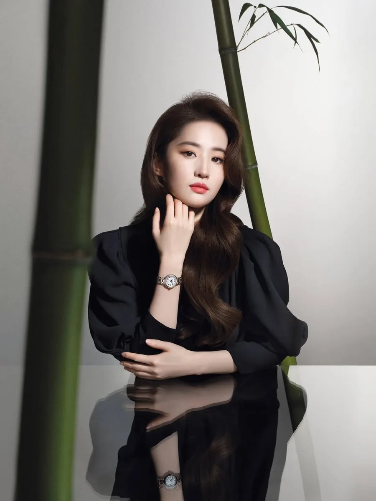

```text
GPT Image 2.5甚至可以当视频模型用，能生成连续顺畅的序列帧

在手机APP的工作标签下或者Codex里输入以下提示词，即可把一张图片变成动态表情包：

为我生成图中角色的卡通Line风格的半身像GIF表情包每一帧的图片，注意头饰和发型要正确。
使用 4行x4列 布局共生成16个小图片。16个小图片为“飞吻”动画的连贯的拆分动作，使用这16张可以组成一个完整的、循环动画，动作流畅逼真，最后一帧应流畅地循环回到第一帧。16张图片里都使用跟图片搭配的字体写着汉字“爱你哦”。16个小图片之间需要有足够留白方便后续切割，每张图片都不要超出自己的区域。
注意不要原图复制，只是使用图片里的人物。背景为纯白色，不要画分割线。图片比例1：1

生成图片后再切分成一张张正方形的小图，切分时尽量切掉更多的空白，然后合成GIF动图
```

[@Gorden_Sun](https://x.com/Gorden_Sun/status/2097508341992083824)

## image editing

### 015 · Restore a low-resolution image without changing its style

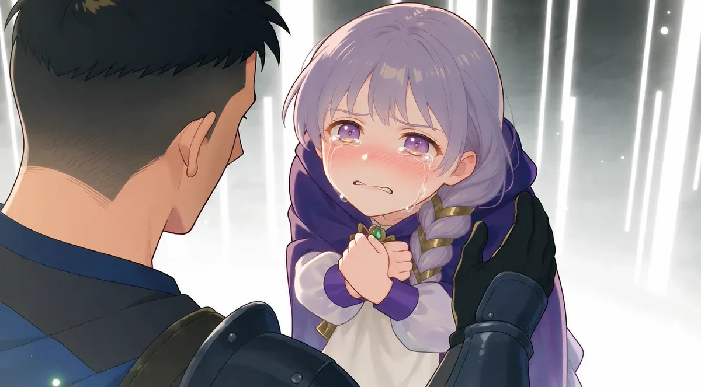

```text
Upscale this low-resolution image. Do not introduce any new artifacts. Preserve the original art style, color treatment and composition exactly, while thoroughly removing noise and making the image clear.
```

[@k_matsumaru](https://x.com/k_matsumaru/status/2097506834659893340)

### 016 · Move the desk lamp and update the lighting

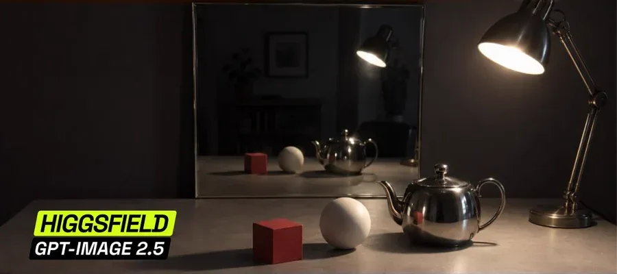

```text
Move the lamp to the right
```

[@higgsfield_ai](https://x.com/higgsfield_ai/status/2097515081802379736)

### 017 · Remove obvious AI artifacts


```text
remove slop
```

[@higgsfield_ai](https://x.com/higgsfield_ai/status/2097556101155955113)

### 018 · Re-shoot a poster from a new angle, layout preserved

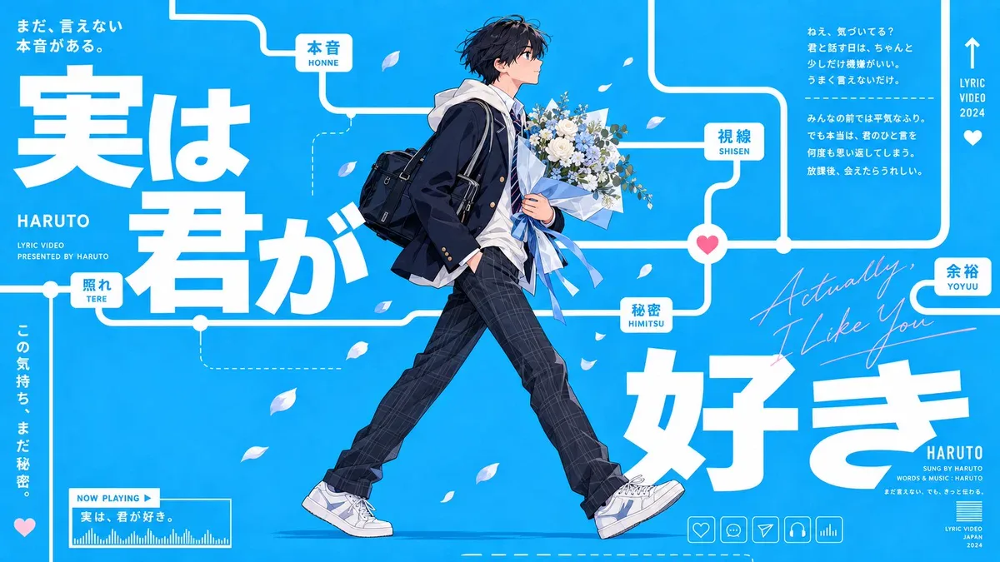

```text
Keep the composition and world of the original design on the right, but remake it from a male perspective. Change all of the text.
```

[@ponzponz15](https://x.com/ponzponz15/status/2097513870969688188)

### 038 · Change the composition with a sketch

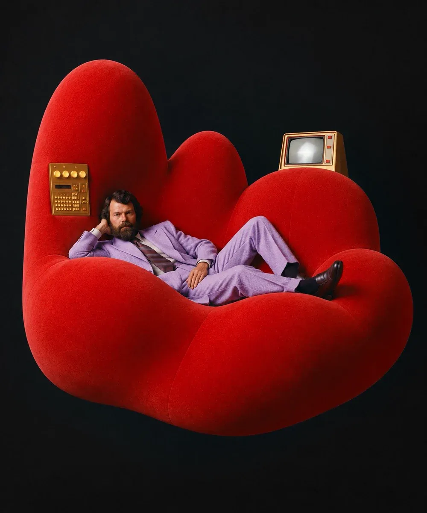

```text
change the composition to this
```

[@Synthetic_Copy](https://x.com/Synthetic_Copy/status/2097461076866560320)

### 039 · Turn a sketch into futuristic architecture


```text
turn it into a future building
```

[@peter6759](https://x.com/peter6759/status/2097503664789430530)

### 040 · Merge multiple references, one job each

```text
Image 1 = subject identity. Image 2 = outfit. Image 3 = setting. Image 4 = framing. Use each source only for its assigned role and merge them into one realistic scene.
```

[@xiaohu](https://x.com/xiaohu/status/2097486974261362853)

### 041 · Lock a base image, change only what you name

```text
Lock this image as the base version. Every attribute stays fixed unless I name it directly. On future edits, touch only the variable I mention, leave everything else exactly as is.
```

[@xiaohu](https://x.com/xiaohu/status/2097486974261362853)

### 042 · Edit one element, leave the rest untouched

```text
Edit only the [ELEMENT] I specify. Keep the surrounding anatomy, material, lighting and angle untouched. Nothing else in the frame should change.
```

[@xiaohu](https://x.com/xiaohu/status/2097486974261362853)

### 043 · Drop a fixed product shot into a new scene

```text
Treat the uploaded product shot as fixed, exact shape, materials, color and branding. Drop it into [SCENE], only adjust the backdrop, light and camera angle.
```

[@xiaohu](https://x.com/xiaohu/status/2097486974261362853)

### 044 · Batch A/B variants with one variable changed

```text
Produce [N] versions of this creative. Keep product, layout, type and lighting identical across all of them. Vary only [ONE VARIABLE].
```

[@xiaohu](https://x.com/xiaohu/status/2097486974261362853)

### 045 · Re-frame to a new aspect ratio without cropping

```text
Rebuild this image for [ASPECT RATIO] without cropping. Keep the subject and visual hierarchy, extend and rearrange the rest of the frame intelligently.
```

[@xiaohu](https://x.com/xiaohu/status/2097486974261362853)

### 046 · Place a UI screenshot into a premium device scene

```text
Keep the uploaded interface exactly as designed, no redesign. Place it inside a premium [DEVICE/SETTING] scene with realistic reflections, lighting and negative space.
```

[@xiaohu](https://x.com/xiaohu/status/2097486974261362853)

### 047 · Apply flat artwork onto a real product surface

```text
Take the artwork in image 1 exactly as is, same composition and colors. Apply it onto [PRODUCT] the way print actually behaves on that material, following its folds and texture.
```

[@xiaohu](https://x.com/xiaohu/status/2097486974261362853)

### 048 · Next shot, same character and location

```text
Use this as the fixed reference for character, outfit and location. Generate the next shot: [SHOT DESCRIPTION]. Only camera angle, framing and pose should change.
```

[@xiaohu](https://x.com/xiaohu/status/2097486974261362853)

### 049 · Generate an A-pose modelling reference

```text
Use image 1 as the character reference. Generate a [VIEW] full body A pose version. Keep silhouette, proportions, materials and details matched, neutral studio light.
```

[@xiaohu](https://x.com/xiaohu/status/2097486974261362853)

### 050 · Replace a single garment, keep everything else

```text
Keep identity, pose, camera, lighting and background untouched. Replace only [GARMENT], using image 2 as reference for cut, material and color.
```

[@xiaohu](https://x.com/xiaohu/status/2097486974261362853)

### 051 · Change one element in an interior, keep the architecture

```text
Keep architecture, dimensions, perspective, doors and windows exactly as shown. Change only [ELEMENT] to [NEW VERSION].
```

[@xiaohu](https://x.com/xiaohu/status/2097486974261362853)

### 052 · Localise the on-image copy only

```text
Keep product, layout and lighting exactly as is. Replace only the visible text with '[NEW TEXT]', adjust background details minimally for [MARKET]. No extra text added.
```

[@xiaohu](https://x.com/xiaohu/status/2097486974261362853)

### 053 · Turn a rough sketch into a clean diagram

```text
Turn this rough sketch into a clean [DIAGRAM/INFOGRAPHIC]. Keep every node, connection and label exactly as drawn. Only refine spacing, alignment and hierarchy.
```

[@xiaohu](https://x.com/xiaohu/status/2097486974261362853)

### 054 · Isolate the product and clean up the edges

```text
Keep the product exactly as is. Remove the background, isolate it on [transparent/plain background]. Only clean up edge artifacts, no changes to color, shape or branding.
```

[@xiaohu](https://x.com/xiaohu/status/2097486974261362853)

## product ads

### 019 · Person holding the product, styled after a reference


```text
Using this JSON as reference, generate a person holding my product.
```

[@Mho_23](https://x.com/Mho_23/status/2097483045221917131)

### 020 · UGC first frame: phone showing the app

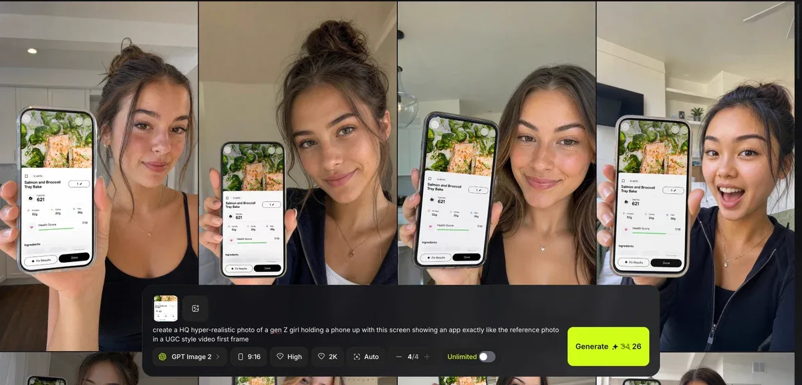

```text
create a HQ hyper-realistic photo of a gen Z girl holding a phone up with this screen showing an app exactly like the reference photo in a UGC style video first frame
```

[@eptwts](https://x.com/eptwts/status/2097477534057128376)

### 034 · Dense frame: 1994 infomercial freeze


```text
a frame grab from a 1994 infomercial, standard definition video with scanlines. A host in a teal blazer, a battered saucer on a rotating plinth with Antarctic ice frozen around one leg, a price starburst, a phone number, and three lines of legal small print.
```

[@ImagineArt_X](https://x.com/ImagineArt_X/status/2097520459969601977)

### 062 · Storefront glass: reflection plus etched type

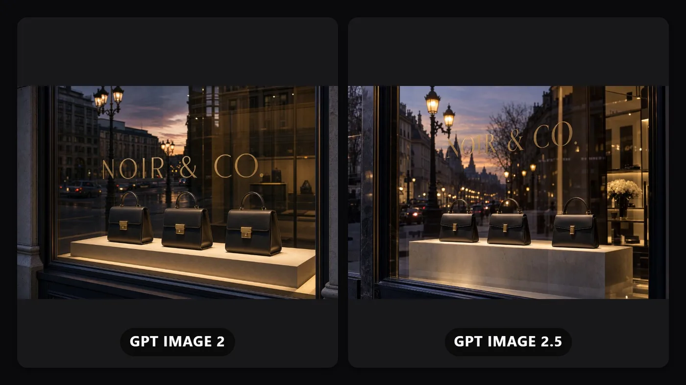

```text
An advertising photo of a flagship store's glass display window at dusk, showing exactly three identical handbags displayed in a row on a lit pedestal inside, with the brand name "NOIR & CO." etched in thin gold lettering on the glass itself, positioned so the etched text overlaps the reflection of the street lamps outside without losing legibility. The reflection on the glass must show a faint mirrored version of the street outside while the three handbags behind the glass remain sharply visible and unreflected-over, dusk color grading, editorial luxury retail photography.

#GPtimage
```

[@opener_ai](https://x.com/opener_ai/status/2097692821272862944)

### 066 · Wooden chess knight 360° turntable


```text
Comparing GPT-Image 2.0 to GPT-Image 2.5

Prompt below:

"Create a photorealistic studio turntable video of a polished wooden chess knight.

The knight has a minimalist carved horse silhouette: broad flat sides, a rounded elongated muzzle, a tiny dark eye, an angular ear, and a gently curved neck. A smooth, dark brown insert follows the mane along the back. The figure stands on a wide circular wooden base with several concentric stepped rings.

Use warm brown wood with clearly visible vertical grain, softly rounded edges, and a glossy lacquer finish. Preserve the exact shape, proportions, wood grain, and dark mane insert throughout the video.

The entire chess piece, including its base, rotates smoothly through one complete 360-degree turn around its vertical axis at a constant speed. It stays perfectly centered and firmly on the surface. The first and last frames match for a seamless loop.

Keep the camera completely stationary, looking slightly downward at the piece. Show the entire object with a small margin above and below. Use a seamless light-gray studio background and floor, soft diffused lighting, gentle highlights on the lacquer, and a subtle contact shadow beneath the base.

Duration: 3 seconds. Frame rate: 30 fps. Square 1:1 composition.

No camera movement, zoom, cuts, wobbling, floating, deformation, changing proportions, sliding wood textures, flickering, additional objects, text, or logos."
```

[@higgsfield](https://x.com/higgsfield/status/2097519422407872858)

## ui web

### 031 · TikTok live stream frame with a reference person

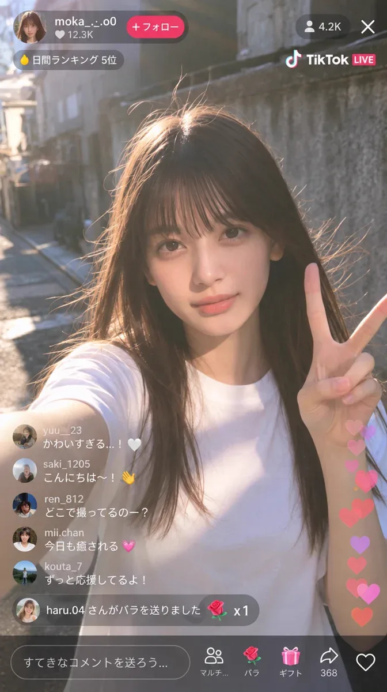

```text
Create a TikTok Live screen showing the woman in the image livestreaming with the phone in her hand.
```

[@sakisuta_](https://x.com/sakisuta_/status/2097558697174294896)

## infographics

### 033 · Dense frame: coffee machine service manual cutaway

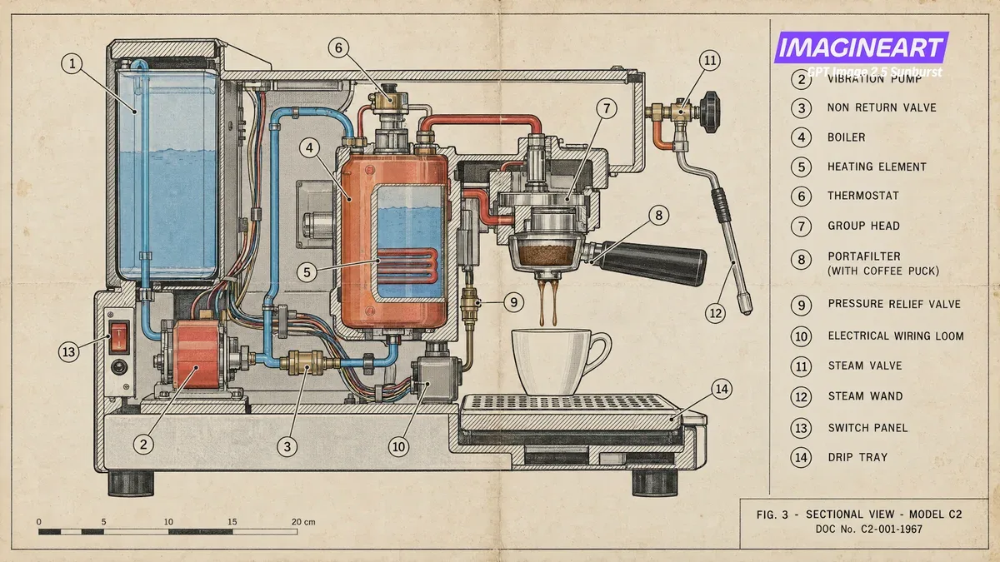

```text
a domestic espresso machine drawn in section, 1960s service manual style, fine black line work with flat spot colour on cream paper. Fourteen numbered leader lines, a key down the right listing all fourteen parts, a scale bar in centimetres, and a title block reading FIG. 3 SECTIONAL VIEW MODEL C2.
```

[@ImagineArt_X](https://x.com/ImagineArt_X/status/2097520459969601977)

### 035 · Dense frame: six-panel newspaper comic

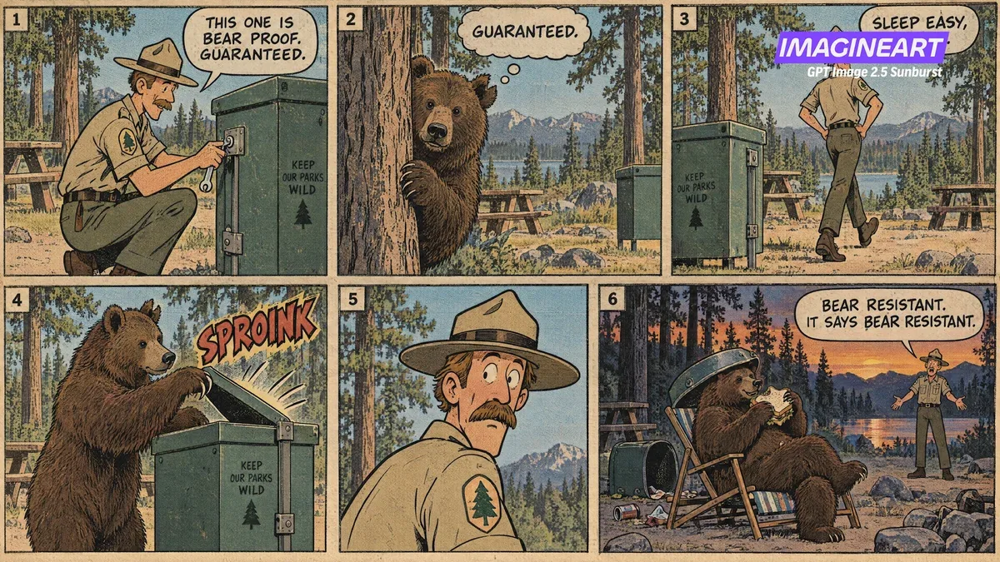

```text
a 1960s Sunday newspaper comic strip on yellowed newsprint, six panels in two rows of three. A park ranger and a bear with a notched ear, the same campsite in every panel, dialogue specified word for word, one sound effect, and one panel with no dialogue at all.
```

[@ImagineArt_X](https://x.com/ImagineArt_X/status/2097520459969601977)

### 036 · Dense frame: Welsh post office notice board


```text
a cork notice board outside a Welsh village post office, overcast light, seven pinned items. A choral society flyer, a lost cat poster on yellow paper, a handwritten piano card, a bus timetable with four times, a sheepdog photo, tear off tabs, and one blank white card.
```

[@ImagineArt_X](https://x.com/ImagineArt_X/status/2097520459969601977)

### 064 · 45° isometric technical teardown infographic

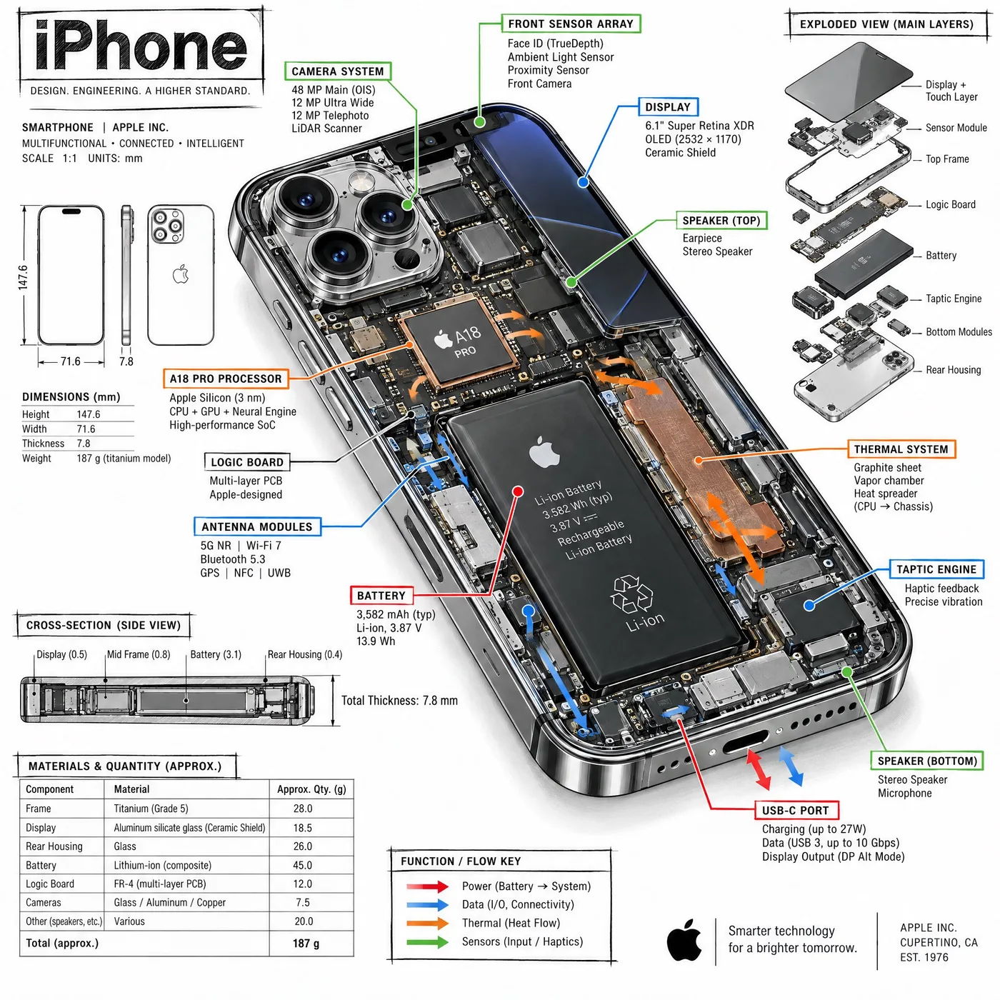

```text
Tried my infographic prompt with GPT Image 2.5 Sunburst 🧾✨

Prompt👇🏻 https://t.co/dHQDNydxoA
```

[@TechieBySA](https://x.com/TechieBySA/status/2097692061554118999)

### 077 · Ten-panel storyboard for an autumn pyjama ad

```text
私は新しい疲労回復パジャマ（秋向け）の広告動画を作りたい。
疲労回復パジャマの名称は「RAKUNE」
その広告動画のストーリーボードを作って。
動画の尺は15秒。
映像スタイルはモーショングラフィックス。
カットの数は10。
動きがあり、派手なモーショングラフィックスにして欲しい。
癒しよりも「元気」や「活力」を打ち出したい。
CMに登場するのは架空の若手の日本人女優。
ナチュラルな魅力で、好感度は抜群、という設定。
全10カットの絵コンテを作って。アスペクト比は横長（16:9）
```

[@tanabe_fragm](https://x.com/tanabe_fragm/status/2097561594540773563)
